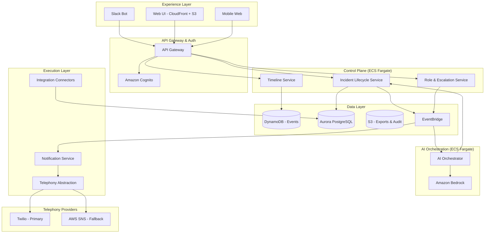
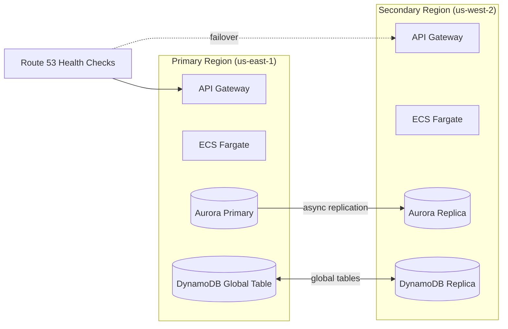
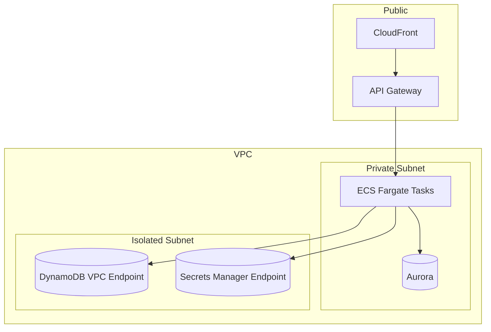

# PD Lite – AWS Technical Architecture

This document proposes a production-ready AWS architecture for PD Lite, designed to meet the requirements for reliability, multi-region failover, AI integration, and Slack-first incident management.

---

## Architecture Overview

---

## Component Breakdown

### 1. Experience Layer

| Component | AWS Service | Notes |
|-----------|-------------|-------|
| **Web UI** | CloudFront + S3 | Static React SPA, global edge distribution |
| **Slack Integration** | Lambda + API Gateway | Webhook handlers for Slack events and slash commands |
| **Mobile Web** | Same as Web UI | Responsive PWA, no native app for MVP |

---

### 2. API Gateway & Authentication

| Component | AWS Service | Notes |
|-----------|-------------|-------|
| **API Gateway** | Amazon API Gateway (HTTP) | Rate limiting, request validation, CORS |
| **Authentication** | Amazon Cognito | Google/GitHub OIDC for MVP; break-glass local accounts |
| **Authorization** | Cognito + Custom Claims | Simple role-based access; no complex RBAC for MVP |

> [!TIP]
> Cognito supports Google and GitHub as OIDC providers out-of-the-box, enabling 15-minute onboarding.

---

### 3. Control Plane Services (ECS Fargate)

All core business logic runs on **ECS Fargate** for serverless container orchestration.

| Service | Responsibility |
|---------|----------------|
| **Incident Lifecycle Service** | Declare, update, escalate, resolve incidents |
| **Role & Escalation Service** | IC assignment, responder suggestions, escalation policies |
| **Timeline Service** | Append-only event log, timeline construction |

**Why Fargate over Lambda?**
- Long-running operations (AI calls, webhook retries)
- Easier local development with containers
- Predictable latency for incident-critical paths

---

### 4. AI Orchestration Layer

| Component | AWS Service | Notes |
|-----------|-------------|-------|
| **AI Orchestrator** | ECS Fargate | Coordinates AI agents, manages context windows |
| **LLM Provider** | Amazon Bedrock (Claude) | No GPU management; usage-based pricing |
| **Context Store** | DynamoDB | Bounded context per incident for AI grounding |

**AI Agent Mapping:**

| Agent | Bedrock Model | Trigger |
|-------|---------------|---------|
| Triage Agent | Claude 3 Sonnet | Incident declaration |
| IC Copilot | Claude 3 Sonnet | Every 5 min or on stall detection |
| Communications Agent | Claude 3 Haiku | On update request |
| Post-Incident Agent | Claude 3 Sonnet | Incident resolution |

> [!IMPORTANT]
> All AI suggestions are advisory only. No autonomous actions per the MVP AI Behavior Contract.

---

### 5. Notification & Telephony

| Component | AWS Service | Notes |
|-----------|-------------|-------|
| **Notification Service** | ECS Fargate | Orchestrates multi-channel delivery |
| **Telephony Abstraction** | Lambda | Provider-agnostic wrapper |
| **Primary SMS/Voice** | Twilio | Reliable, global coverage |
| **Fallback SMS** | AWS SNS | Secondary provider for redundancy |
| **Circuit Breaker** | Custom in-service | Auto-failover within 60 seconds |

**Resilience Features:**
- Delivery attempts logged with timestamps
- Automatic failover on provider errors
- Multi-region telephony (independent of primary AWS region)

---

### 6. Integration Connectors

| Connector | Implementation | Notes |
|-----------|----------------|-------|
| **Backstage** | ECS Fargate Task | Config-driven, incremental sync |
| **ServiceNow** | Future | Not in MVP |

Connectors use the declarative framework defined in [pd_lite_service_catalog_connector_spec_config_driven.md](file:///Users/avijay/Documents/src/pd-lite/requirements/pd_lite_service_catalog_connector_spec_config_driven.md).

---

### 7. Data Layer

| Data Type | AWS Service | Rationale |
|-----------|-------------|-----------|
| **Incident Events** | DynamoDB (On-Demand) | Append-only, single-digit ms latency, auto-scaling |
| **Relational Data** | Aurora PostgreSQL Serverless v2 | Services, users, config; scales to zero |
| **Audit Logs** | S3 + Athena | Immutable, queryable, cost-effective |
| **Event Bus** | EventBridge | Decouple services, enable replay |
| **Secrets** | AWS Secrets Manager | Token storage, automatic rotation |

> [!NOTE]
> DynamoDB's append-only design ensures incident state is never lost per the core invariants.

---

## Multi-Region & Disaster Recovery

### Active-Passive Multi-Region

| Component | DR Strategy |
|-----------|-------------|
| **DynamoDB** | Global Tables (active-active) |
| **Aurora** | Cross-region read replica, manual failover |
| **ECS** | Pre-deployed in secondary, activated on failover |
| **Telephony** | Region-independent (Twilio + SNS) |

**SLOs:**
- Regional failover RTO: < 5 minutes
- Zero incident state loss (DynamoDB Global Tables)

---

## Security Architecture

### Network

| Control | Implementation |
|---------|----------------|
| **Network Isolation** | Private subnets, VPC endpoints |
| **Encryption in Transit** | TLS 1.3 everywhere |
| **Encryption at Rest** | KMS-managed keys (AES-256) |
| **Secrets** | Secrets Manager + IAM roles |
| **WAF** | AWS WAF on CloudFront + API Gateway |
| **Audit Logging** | CloudTrail + VPC Flow Logs |

---

## Observability

| Capability | AWS Service | Notes |
|------------|-------------|-------|
| **Metrics** | CloudWatch Metrics | Custom metrics for SLOs |
| **Logs** | CloudWatch Logs | Structured JSON, 30-day retention |
| **Traces** | X-Ray | End-to-end request tracing |
| **Dashboards** | CloudWatch Dashboards | Incident health, paging delivery |
| **Alerts** | CloudWatch Alarms → SNS | Pager escalation for PD Lite itself |

**Key SLO Metrics:**
- Paging delivery < 30 seconds
- Chat command acknowledgement < 1 second
- API Gateway p99 latency < 200ms

---

## Cost Estimation (MVP Scale)

Assuming ~100 incidents/month, 500 notifications/month, 10 active users:

| Service | Estimated Monthly Cost |
|---------|------------------------|
| ECS Fargate (3 services) | ~$50-100 |
| Aurora Serverless v2 | ~$30-50 |
| DynamoDB On-Demand | ~$5-10 |
| API Gateway | ~$5 |
| Bedrock (Claude) | ~$50-100 |
| Twilio (SMS/Voice) | ~$50-100 |
| CloudFront + S3 | ~$5 |
| Secrets Manager | ~$5 |
| **Total** | **~$200-400/month** |

> [!TIP]
> The architecture scales to zero when idle (Aurora Serverless, DynamoDB On-Demand) making it startup-friendly.

---

## Technology Choices Summary

| Layer | Choice | Rationale |
|-------|--------|-----------|
| **Compute** | ECS Fargate | Serverless containers, no cold starts for critical paths |
| **LLM** | Amazon Bedrock (Claude) | Managed, no GPU ops, usage-based |
| **Primary DB** | Aurora PostgreSQL Serverless v2 | Relational flexibility, scales to zero |
| **Event Store** | DynamoDB | Append-only, global tables, single-digit ms |
| **Event Bus** | EventBridge | Native AWS integration, replay support |
| **Auth** | Cognito | OIDC support, break-glass accounts |
| **CDN** | CloudFront | Global edge, WebSocket support |
| **IaC** | Terraform | Industry standard, multi-cloud portable |

---

## Verification Plan

This is an architecture planning document—implementation verification will be defined when we move to execution. The following would be validated during build:

### Infrastructure Validation
- CDK synth produces valid CloudFormation
- Security group rules allow only required traffic
- VPC endpoints are correctly configured

### Functional Validation
- End-to-end incident flow (Slack → API → DB → Notification)
- Telephony failover test (simulate Twilio outage)
- AI suggestions appear within 5 seconds of incident declaration

### Resilience Validation
- Chaos test: kill primary region, verify failover < 5 minutes
- Load test: 1000 concurrent incidents, verify SLOs hold

---

## Decisions Made

| Decision | Choice | Rationale |
|----------|--------|----------|
| **Regions** | us-east-1 (primary), us-west-2 (secondary) | Good coverage, low latency |
| **LLM Provider** | Amazon Bedrock (Claude) | AWS-native, managed |
| **Compute** | ECS Fargate | Simpler than EKS for MVP |
| **IaC** | Terraform | Industry standard |
| **Slack Webhooks** | Lambda | Fast cold starts, cost efficient |
