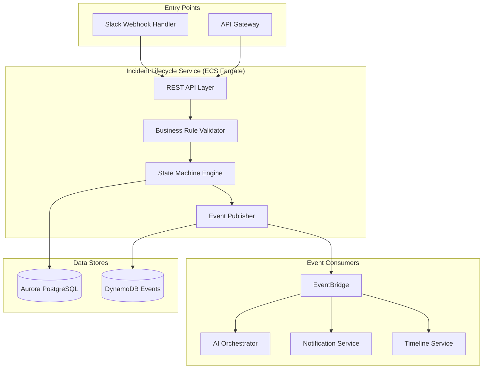
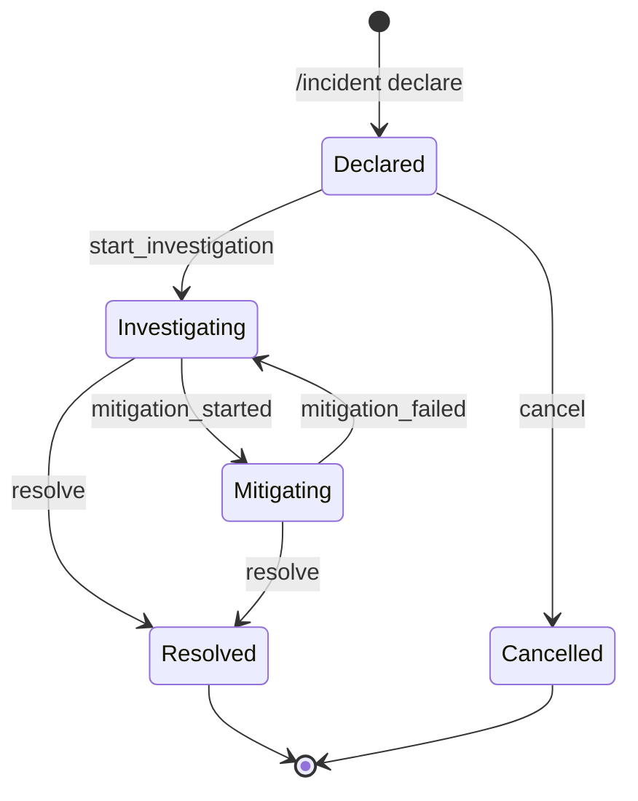

# PD Lite – Incident Lifecycle Service Design

## Overview

The Incident Lifecycle Service is the core state machine for incidents. It manages the full lifecycle from declaration to resolution, enforcing state transitions and emitting events that drive downstream systems.

---

## Responsibilities

| Responsibility | Description |
|----------------|-------------|
| **Incident Declaration** | Accept incident creation from Slack, Web, or API |
| **State Management** | Enforce valid state transitions (Declared → Investigating → Mitigating → Resolved) |
| **Severity Management** | Accept severity updates (human-controlled, AI-suggested) |
| **Service Association** | Link incidents to services from the catalog |
| **Event Emission** | Emit all state changes to EventBridge for downstream consumers |
| **Incident Query** | Provide read APIs for active and historical incidents |

---

## Architecture



---

## Data Model

### Incident Entity (Aurora PostgreSQL)

```sql
CREATE TABLE incidents (
    id              UUID PRIMARY KEY DEFAULT gen_random_uuid(),
    tenant_id       UUID NOT NULL,
    title           VARCHAR(500) NOT NULL,
    description     TEXT,
    severity        VARCHAR(20) NOT NULL DEFAULT 'unknown',
    status          VARCHAR(20) NOT NULL DEFAULT 'declared',
    declared_at     TIMESTAMPTZ NOT NULL DEFAULT NOW(),
    resolved_at     TIMESTAMPTZ,
    incident_commander_id UUID,
    affected_services JSONB DEFAULT '[]',
    metadata        JSONB DEFAULT '{}',
    created_at      TIMESTAMPTZ NOT NULL DEFAULT NOW(),
    updated_at      TIMESTAMPTZ NOT NULL DEFAULT NOW(),
    
    CONSTRAINT valid_severity CHECK (severity IN ('sev1', 'sev2', 'sev3', 'sev4', 'unknown')),
    CONSTRAINT valid_status CHECK (status IN ('declared', 'investigating', 'mitigating', 'resolved', 'cancelled'))
);

CREATE INDEX idx_incidents_tenant_status ON incidents(tenant_id, status);
CREATE INDEX idx_incidents_declared_at ON incidents(declared_at DESC);
```

### Incident Event (DynamoDB)

```json
{
  "PK": "INCIDENT#<incident_id>",
  "SK": "EVENT#<timestamp>#<event_id>",
  "event_type": "incident.declared | incident.severity_changed | incident.resolved | ...",
  "actor_type": "human | ai | system",
  "actor_id": "<user_id | agent_name | system>",
  "payload": { /* event-specific data */ },
  "timestamp": "2026-01-29T17:00:00Z",
  "version": 1
}
```

---

## State Machine



### Transition Rules

| From | To | Allowed Actors | Side Effects |
|------|-----|----------------|--------------|
| `declared` | `investigating` | Human, System | Emit event, notify responders |
| `declared` | `cancelled` | Human (IC only) | Emit event |
| `investigating` | `mitigating` | Human | Emit event |
| `investigating` | `resolved` | Human (IC only) | Emit event, trigger post-incident |
| `mitigating` | `resolved` | Human (IC only) | Emit event, trigger post-incident |
| `mitigating` | `investigating` | Human | Emit event (mitigation regressed) |

---

## API Design

### Endpoints

| Method | Path | Description |
|--------|------|-------------|
| `POST` | `/v1/incidents` | Declare a new incident |
| `GET` | `/v1/incidents` | List incidents (with filters) |
| `GET` | `/v1/incidents/{id}` | Get incident details |
| `PATCH` | `/v1/incidents/{id}` | Update incident (severity, title, services) |
| `POST` | `/v1/incidents/{id}/transition` | Transition incident state |
| `POST` | `/v1/incidents/{id}/assign-ic` | Assign incident commander |

### Example: Declare Incident

**Request:**
```json
POST /v1/incidents
{
  "title": "API latency spike",
  "description": "P99 latency > 5s on payment-api",
  "severity": "sev2",
  "source": "slack",
  "affected_services": ["payment-api"],
  "declared_by": "user_abc123"
}
```

**Response:**
```json
{
  "id": "inc_01HXYZ...",
  "title": "API latency spike",
  "severity": "sev2",
  "status": "declared",
  "declared_at": "2026-01-29T17:00:00Z",
  "incident_commander": null,
  "affected_services": ["payment-api"],
  "links": {
    "slack_channel": "#inc-01hxyz-api-latency",
    "web_url": "https://app.pdlite.io/incidents/inc_01HXYZ"
  }
}
```

---

## Event Schema

All events follow a standard envelope:

```json
{
  "event_id": "evt_...",
  "event_type": "incident.declared",
  "timestamp": "2026-01-29T17:00:00Z",
  "tenant_id": "tenant_...",
  "incident_id": "inc_...",
  "actor": {
    "type": "human",
    "id": "user_..."
  },
  "payload": {
    "title": "API latency spike",
    "severity": "sev2",
    "affected_services": ["payment-api"]
  },
  "version": 1
}
```

### Event Types

| Event | Trigger | Key Consumers |
|-------|---------|---------------|
| `incident.declared` | New incident | AI Triage, Notification, Timeline |
| `incident.severity_changed` | Severity update | Notification (re-page for upgrade) |
| `incident.status_changed` | State transition | AI Copilot, Timeline |
| `incident.ic_assigned` | IC assignment | Notification |
| `incident.resolved` | Resolution | Post-Incident Agent, Analytics |

---

## Resilience

| Failure Mode | Behavior |
|--------------|----------|
| Aurora unavailable | Return 503, events queued in DynamoDB only |
| EventBridge unavailable | Retry with exponential backoff, dead-letter queue |
| Duplicate requests | Idempotency key on declaration prevents duplicates |

---

## Observability

| Metric | Description | Alarm Threshold |
|--------|-------------|-----------------|
| `incidents.declared.count` | New incidents per minute | N/A (informational) |
| `incidents.transition.latency_p99` | State transition latency | > 500ms |
| `incidents.event_publish.failures` | Failed EventBridge publishes | > 0 for 5 min |
| `incidents.active.count` | Currently active incidents | N/A (informational) |

---

## Technology Stack

| Component | Technology |
|-----------|------------|
| Runtime | Node.js 20 (TypeScript) or Go |
| Framework | Fastify or Gin |
| ORM | Prisma (Node) or sqlc (Go) |
| Container | Docker on ECS Fargate |
| Tracing | AWS X-Ray |

---

## Open Questions

1. **Soft Delete vs Hard Delete**: Should cancelled/resolved incidents be archived after a retention period? (Yes) Keep them in a separate archive table for 180 days.
2. **Incident Numbering**: Sequential per-tenant (INC-001) vs global UUID? (Yes) Sequential per-tenant.
3. **State Machine Library**: Custom implementation vs a library like XState? Let's use XState.
