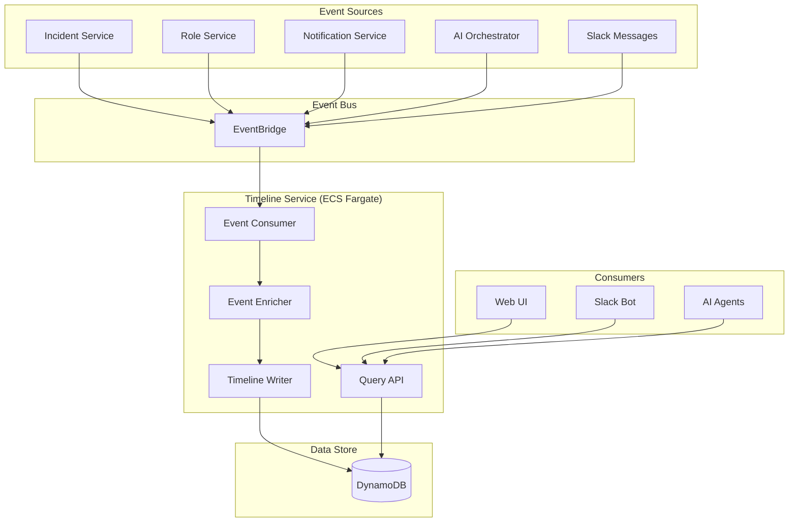

# PD Lite – Timeline Service Design

## Overview

The Timeline Service maintains an append-only, immutable log of all events that occur during an incident. It serves as the source of truth for incident history and provides the foundation for AI context, post-incident reviews, and audit trails.

---

## Responsibilities

| Responsibility | Description |
|----------------|-------------|
| **Event Ingestion** | Consume events from EventBridge and append to timeline |
| **Timeline Construction** | Build ordered, human-readable incident timelines |
| **Context Provision** | Provide bounded context windows for AI agents |
| **Query API** | Serve timeline data to Web UI, Slack, and other services |
| **Export** | Support timeline export for post-incident reviews |

---

## Architecture



---

## Data Model

### Timeline Event (DynamoDB)

**Table: `timeline_events`**

| Attribute | Type | Description |
|-----------|------|-------------|
| `PK` | String | `INCIDENT#<incident_id>` |
| `SK` | String | `TS#<timestamp>#<event_id>` (sortable) |
| `GSI1PK` | String | `TENANT#<tenant_id>` |
| `GSI1SK` | String | `TS#<timestamp>` |
| `event_id` | String | Unique event identifier |
| `event_type` | String | Categorized event type |
| `event_category` | String | `state_change`, `communication`, `ai_action`, `notification`, `human_action` |
| `actor` | Map | `{ type, id, name }` |
| `summary` | String | Human-readable one-liner |
| `payload` | Map | Full event payload |
| `timestamp` | String | ISO 8601 timestamp |
| `ttl` | Number | Optional TTL for data retention |

### Example Event

```json
{
  "PK": "INCIDENT#inc_01HXYZ",
  "SK": "TS#2026-01-29T17:00:00.000Z#evt_abc123",
  "event_id": "evt_abc123",
  "event_type": "incident.declared",
  "event_category": "state_change",
  "actor": {
    "type": "human",
    "id": "user_jane",
    "name": "Jane Smith"
  },
  "summary": "Jane Smith declared incident: API latency spike",
  "payload": {
    "title": "API latency spike",
    "severity": "sev2",
    "source": "slack"
  },
  "timestamp": "2026-01-29T17:00:00.000Z"
}
```

---

## Event Categories

| Category | Examples | Source |
|----------|----------|--------|
| `state_change` | Incident declared, status changed, severity changed | Incident Service |
| `role_change` | IC assigned, responder added/removed | Role Service |
| `communication` | Slack message in incident channel, status update posted | Slack integration |
| `ai_action` | AI suggested severity, AI drafted update | AI Orchestrator |
| `notification` | Page sent, page acknowledged, page failed | Notification Service |
| `human_action` | Manual notes, runbook executed | User actions |

---

## API Design

### Endpoints

| Method | Path | Description |
|--------|------|-------------|
| `GET` | `/v1/incidents/{id}/timeline` | Get full timeline for incident |
| `GET` | `/v1/incidents/{id}/timeline/context` | Get bounded context for AI |
| `POST` | `/v1/incidents/{id}/timeline/note` | Add manual note to timeline |
| `GET` | `/v1/incidents/{id}/timeline/export` | Export timeline as JSON/Markdown |

### Query Parameters

| Param | Type | Description |
|-------|------|-------------|
| `since` | ISO timestamp | Events after this time |
| `until` | ISO timestamp | Events before this time |
| `categories` | String[] | Filter by event category |
| `limit` | Number | Max events to return (default 100) |
| `cursor` | String | Pagination cursor |

### Example: Get Timeline

**Request:**
```
GET /v1/incidents/inc_01HXYZ/timeline?limit=50
```

**Response:**
```json
{
  "incident_id": "inc_01HXYZ",
  "events": [
    {
      "event_id": "evt_001",
      "timestamp": "2026-01-29T17:00:00Z",
      "event_type": "incident.declared",
      "category": "state_change",
      "actor": { "type": "human", "name": "Jane Smith" },
      "summary": "Jane Smith declared incident: API latency spike"
    },
    {
      "event_id": "evt_002",
      "timestamp": "2026-01-29T17:00:05Z",
      "event_type": "ai.severity_suggested",
      "category": "ai_action",
      "actor": { "type": "ai", "name": "Triage Agent" },
      "summary": "AI suggested severity SEV2 (confidence: 85%)"
    }
  ],
  "cursor": "eyJsYXN0X2tl...",
  "has_more": true
}
```

---

## AI Context API

The Timeline Service provides a specialized endpoint for AI agents that returns a bounded, token-efficient context window.

### Endpoint

```
GET /v1/incidents/{id}/timeline/context
```

### Parameters

| Param | Type | Description |
|-------|------|-------------|
| `max_tokens` | Number | Approximate token budget (default 4000) |
| `focus` | String | `recent`, `summary`, `communications` |

### Response

```json
{
  "incident_id": "inc_01HXYZ",
  "context_window": {
    "incident_summary": "API latency spike affecting payment-api, SEV2, investigating",
    "key_actors": ["Jane Smith (IC)", "John Doe (Responder)"],
    "affected_services": ["payment-api"],
    "timeline_summary": [
      "17:00 - Incident declared by Jane Smith",
      "17:05 - AI suggested SEV2, accepted by IC",
      "17:10 - John Doe paged and acknowledged",
      "17:15 - Preliminary investigation: DB connection pool exhausted"
    ],
    "recent_events": [ /* last 10 events */ ],
    "open_questions": [],
    "approximate_tokens": 450
  }
}
```

---

## Event Enrichment

The Enricher component adds context before writing events:

| Enrichment | Source | Purpose |
|------------|--------|---------|
| Actor name resolution | User service | Display names instead of IDs |
| Service metadata | Service catalog | Add service context to events |
| Summary generation | Template or AI | Create human-readable summaries |
| Deduplication check | Recent events | Prevent duplicate entries |

---

## Resilience

| Failure Mode | Behavior |
|--------------|----------|
| DynamoDB unavailable | Events queued in SQS, retried with backoff |
| Event processing failure | Dead-letter queue, manual replay available |
| Duplicate events | Idempotency based on `event_id` |

### Event Ordering Guarantees

- Events are ordered by timestamp within an incident
- Late-arriving events are inserted at correct position
- Consumers should handle out-of-order delivery gracefully

---

## Observability

| Metric | Description | Alarm Threshold |
|--------|-------------|-----------------|
| `timeline.events.ingested` | Events written per minute | N/A |
| `timeline.write.latency_p99` | Write latency | > 100ms |
| `timeline.query.latency_p99` | Query latency | > 200ms |
| `timeline.dlq.depth` | Dead-letter queue depth | > 0 for 10 min |

---

## Technology Stack

| Component | Technology |
|-----------|------------|
| Runtime | Node.js 20 (TypeScript) |
| Framework | Fastify |
| Event Consumer | EventBridge Pipes or Lambda |
| Data Store | DynamoDB |
| Container | Docker on ECS Fargate |

---

## Open Questions

1. **Real-time Updates**: Should the timeline support WebSocket subscriptions for live updates? (Yes)
2. **Slack Message Ingestion**: Ingest all channel messages or only structured commands? (Only structured commands)
3. **Token Counting**: Use tiktoken for accurate AI context budgeting? (Yes)

