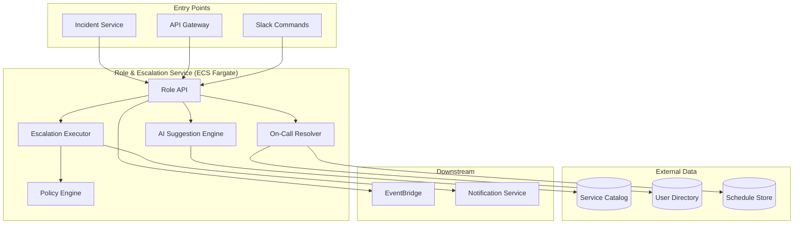
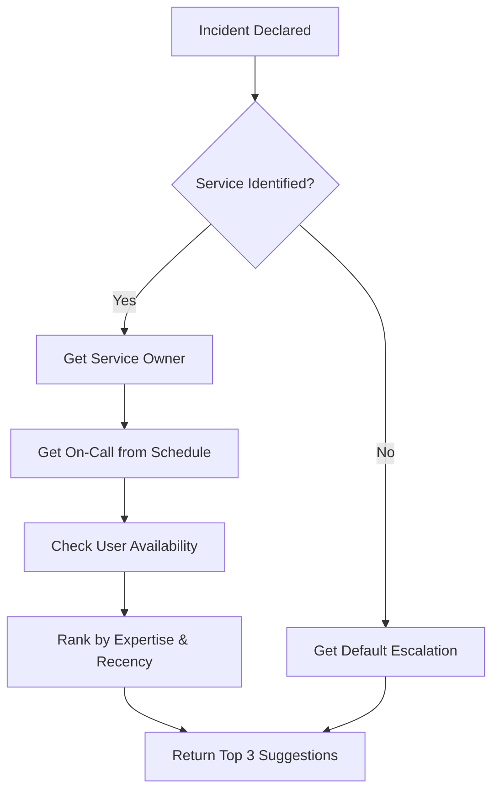
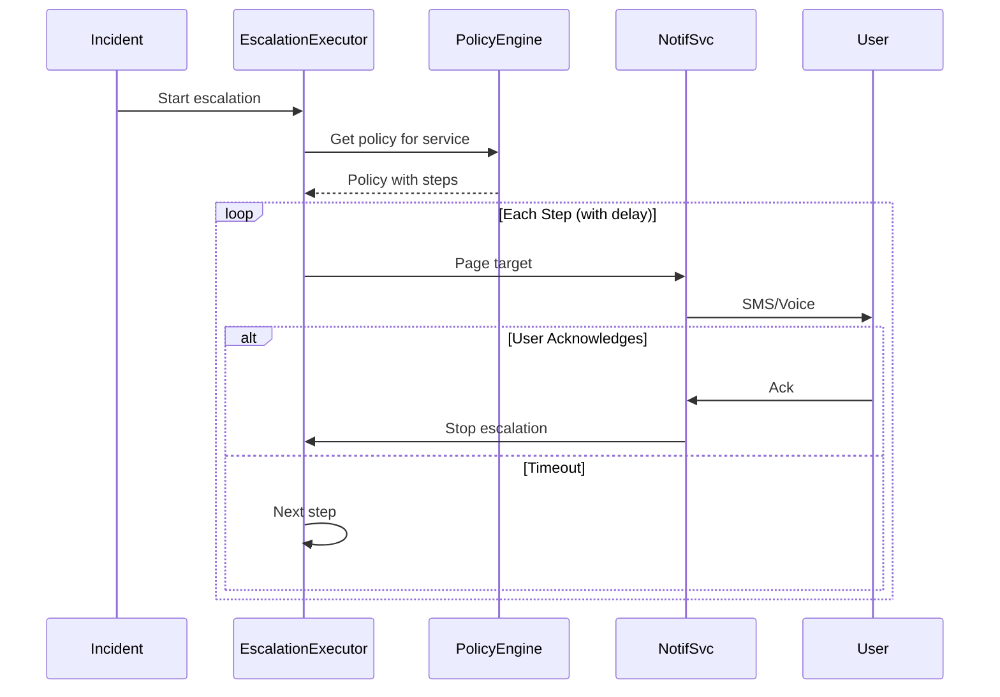

# PD Lite – Role & Escalation Service Design

## Overview

The Role & Escalation Service manages role assignments during incidents (Incident Commander, Responders, Communications Lead) and handles escalation policies. It ensures the right people are engaged at the right time.

---

## Responsibilities

| Responsibility | Description |
|----------------|-------------|
| **Role Management** | Assign, reassign, and track incident roles |
| **Responder Suggestions** | Provide AI-assisted responder recommendations |
| **On-Call Resolution** | Resolve who is currently on-call for a service |
| **Escalation Policies** | Execute time-based and condition-based escalations |
| **Availability Tracking** | Track acknowledgements and response status |

---

## Architecture



---

## Data Model

### Incident Roles (Aurora PostgreSQL)

```sql
CREATE TABLE incident_roles (
    id              UUID PRIMARY KEY DEFAULT gen_random_uuid(),
    incident_id     UUID NOT NULL REFERENCES incidents(id),
    user_id         UUID NOT NULL,
    role            VARCHAR(50) NOT NULL,
    assigned_at     TIMESTAMPTZ NOT NULL DEFAULT NOW(),
    assigned_by     UUID,  -- null if system/AI suggested
    acknowledged_at TIMESTAMPTZ,
    released_at     TIMESTAMPTZ,
    
    CONSTRAINT valid_role CHECK (role IN (
        'incident_commander', 'responder', 'communications_lead', 
        'scribe', 'subject_matter_expert', 'observer'
    ))
);

CREATE INDEX idx_roles_incident ON incident_roles(incident_id);
CREATE INDEX idx_roles_user ON incident_roles(user_id, released_at);
```

### Escalation Policy (Aurora PostgreSQL)

```sql
CREATE TABLE escalation_policies (
    id              UUID PRIMARY KEY DEFAULT gen_random_uuid(),
    tenant_id       UUID NOT NULL,
    name            VARCHAR(200) NOT NULL,
    description     TEXT,
    is_default      BOOLEAN DEFAULT FALSE,
    created_at      TIMESTAMPTZ NOT NULL DEFAULT NOW()
);

CREATE TABLE escalation_steps (
    id              UUID PRIMARY KEY DEFAULT gen_random_uuid(),
    policy_id       UUID NOT NULL REFERENCES escalation_policies(id),
    step_order      INTEGER NOT NULL,
    delay_minutes   INTEGER NOT NULL DEFAULT 5,
    target_type     VARCHAR(50) NOT NULL,  -- 'user', 'schedule', 'service_owner'
    target_id       UUID,
    notify_channels VARCHAR(50)[] DEFAULT ARRAY['sms', 'voice'],
    
    CONSTRAINT valid_target CHECK (target_type IN ('user', 'schedule', 'service_owner'))
);
```

### On-Call Schedule (Aurora PostgreSQL)

```sql
CREATE TABLE schedules (
    id              UUID PRIMARY KEY DEFAULT gen_random_uuid(),
    tenant_id       UUID NOT NULL,
    name            VARCHAR(200) NOT NULL,
    timezone        VARCHAR(50) NOT NULL DEFAULT 'UTC',
    created_at      TIMESTAMPTZ NOT NULL DEFAULT NOW()
);

CREATE TABLE schedule_layers (
    id              UUID PRIMARY KEY DEFAULT gen_random_uuid(),
    schedule_id     UUID NOT NULL REFERENCES schedules(id),
    layer_order     INTEGER NOT NULL,
    rotation_type   VARCHAR(20) NOT NULL,  -- 'daily', 'weekly', 'custom'
    start_time      TIME,
    end_time        TIME,
    users           UUID[] NOT NULL
);
```

---

## Core Roles

| Role | Description | Permissions |
|------|-------------|-------------|
| `incident_commander` | Owns the incident, makes decisions | Assign roles, change severity, resolve |
| `responder` | Actively working on the incident | Update status, add notes |
| `communications_lead` | Handles stakeholder updates | Draft/send status updates |
| `scribe` | Documents actions and decisions | Add notes to timeline |
| `subject_matter_expert` | Domain expertise on call | Read-only, can be promoted |
| `observer` | Watching without active role | Read-only access |

---

## API Design

### Role Endpoints

| Method | Path | Description |
|--------|------|-------------|
| `GET` | `/v1/incidents/{id}/roles` | List current role assignments |
| `POST` | `/v1/incidents/{id}/roles` | Assign a role |
| `DELETE` | `/v1/incidents/{id}/roles/{role_id}` | Remove role assignment |
| `POST` | `/v1/incidents/{id}/roles/suggest` | Get AI-suggested responders |
| `POST` | `/v1/incidents/{id}/roles/{role_id}/acknowledge` | Acknowledge assignment |

### Escalation Endpoints

| Method | Path | Description |
|--------|------|-------------|
| `GET` | `/v1/escalation-policies` | List policies |
| `POST` | `/v1/escalation-policies` | Create policy |
| `GET` | `/v1/escalation-policies/{id}` | Get policy details |
| `PUT` | `/v1/escalation-policies/{id}` | Update policy |

### Schedule Endpoints

| Method | Path | Description |
|--------|------|-------------|
| `GET` | `/v1/schedules` | List schedules |
| `GET` | `/v1/schedules/{id}/on-call` | Get current on-call user |
| `GET` | `/v1/services/{id}/on-call` | Get on-call for a service |

---

## AI Responder Suggestions

The Suggestion Engine uses service catalog and historical data to recommend responders.

### Suggestion Algorithm



### Suggestion Factors

| Factor | Weight | Source |
|--------|--------|--------|
| On-call for affected service | High | Schedule |
| Service owner | High | Service catalog |
| Recent responder for similar incidents | Medium | Historical incidents |
| Current availability (not in other incident) | Medium | Active incidents |
| Time since last page | Low | Page history |

### Suggestion Response

```json
{
  "incident_id": "inc_01HXYZ",
  "suggestions": [
    {
      "user_id": "user_jane",
      "name": "Jane Smith",
      "recommended_role": "incident_commander",
      "reason": "On-call for payment-api",
      "confidence": 0.92
    },
    {
      "user_id": "user_john",
      "name": "John Doe",
      "recommended_role": "responder",
      "reason": "Service owner for payment-api",
      "confidence": 0.85
    }
  ],
  "ai_model": "triage-agent-v1"
}
```

---

## Escalation Engine

### Escalation Flow



### Escalation Rules

| Condition | Action |
|-----------|--------|
| No acknowledgement in N minutes | Escalate to next step |
| All steps exhausted | Notify admins, log critical event |
| User acknowledges | Stop escalation for that target |
| Incident resolves | Cancel all pending escalations |
| Severity upgrade | Restart escalation with faster timing |

---

## Events Emitted

| Event | Trigger | Payload |
|-------|---------|---------|
| `role.assigned` | Role added | user, role, incident_id |
| `role.acknowledged` | User acks role | user, role, ack_time |
| `role.released` | Role removed | user, role, reason |
| `escalation.started` | Escalation begins | policy_id, incident_id |
| `escalation.step_executed` | Page sent | step, target, channel |
| `escalation.completed` | Escalation finished | outcome (ack'd, exhausted) |

---

## Resilience

| Failure Mode | Behavior |
|--------------|----------|
| Schedule data unavailable | Use cached on-call, alert admins |
| Escalation step fails | Retry with backoff, continue to next step |
| AI suggestions unavailable | Fall back to on-call/service owner |

---

## Observability

| Metric | Description | Alarm |
|--------|-------------|-------|
| `roles.assign.count` | Role assignments per hour | N/A |
| `escalation.ack.time_p50` | Time to acknowledge | > 5 min |
| `escalation.exhausted.count` | Escalations with no ack | > 0 |
| `suggestions.latency_p99` | AI suggestion latency | > 2s |

---

## Technology Stack

| Component | Technology |
|-----------|------------|
| Runtime | Node.js 20 (TypeScript) |
| Framework | Fastify |
| Scheduler | EventBridge Scheduler (for delays) |
| Data Store | Aurora PostgreSQL |
| Container | Docker on ECS Fargate |

---

## Open Questions

1. **Override Policies**: Should users be able to skip escalation steps manually? (Yes)
2. **Multi-timezone Schedules**: Support schedules spanning timezones? (Yes)
3. **PagerDuty Import**: Should we support importing existing PD schedules/policies? (Yes)

