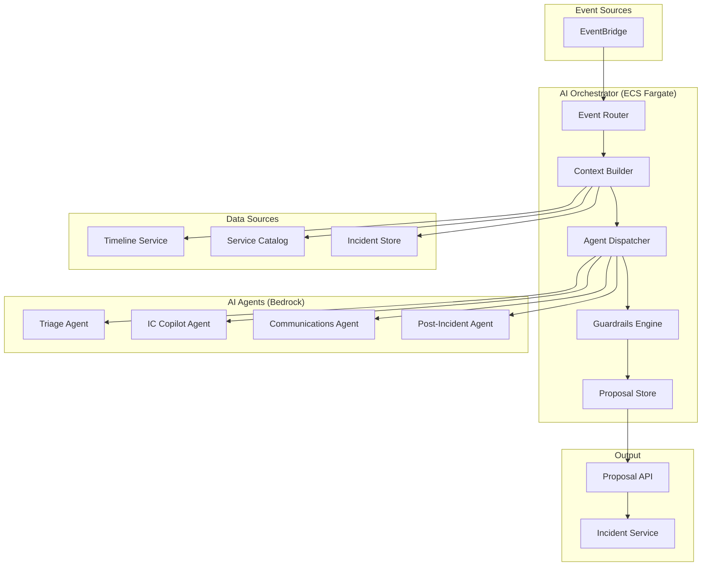
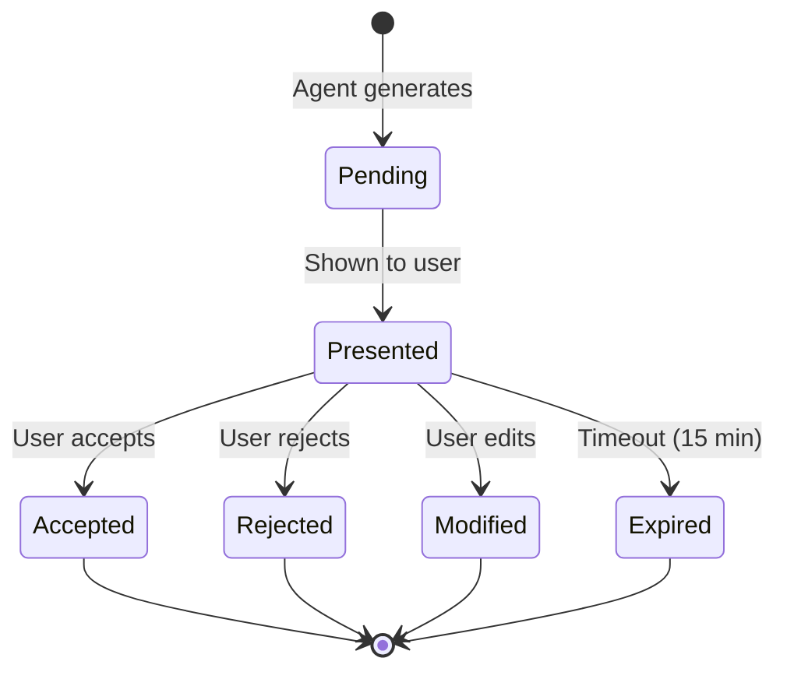

# PD Lite – AI Orchestrator Service Design

## Overview

The AI Orchestrator coordinates all AI agents in PD Lite, managing context assembly, agent invocation, and proposal routing. It ensures AI suggestions are always advisory, grounded in real data, and respect the MVP AI Behavior Contract.

---

## Responsibilities

| Responsibility | Description |
|----------------|-------------|
| **Context Assembly** | Build bounded context windows from incident and service data |
| **Agent Coordination** | Route events to appropriate AI agents |
| **Proposal Management** | Store AI suggestions and track human decisions |
| **Feedback Loop** | Capture accept/reject signals for future improvement |
| **Guardrails Enforcement** | Ensure no autonomous actions violate the behavior contract |

---

## Architecture



---

## AI Agents

### Agent Inventory

| Agent | Trigger Events | Output | Bedrock Model |
|-------|---------------|--------|---------------|
| **Triage Agent** | `incident.declared` | Severity suggestion, responder suggestions | Claude 3 Sonnet |
| **IC Copilot** | Every 5 min, `silence.detected` | Next action suggestions, stall detection | Claude 3 Sonnet |
| **Communications Agent** | `update.requested`, cadence timer | Draft status updates | Claude 3 Haiku |
| **Post-Incident Agent** | `incident.resolved` | Timeline summary, PIR draft | Claude 3 Sonnet |

---

## Context Building

### Context Window Structure

```json
{
  "incident": {
    "id": "inc_01HXYZ",
    "title": "API latency spike",
    "severity": "sev2",
    "status": "investigating",
    "duration_minutes": 25,
    "affected_services": ["payment-api"]
  },
  "service_context": {
    "service_name": "payment-api",
    "owner_team": "Payments",
    "tier": "tier1",
    "dependencies": ["database-primary", "redis-cache"],
    "runbooks": ["https://docs.internal/payment-api/latency"]
  },
  "timeline_summary": [
    "17:00 - Incident declared by Jane",
    "17:02 - SEV2 confirmed",
    "17:10 - John paged and acknowledged"
  ],
  "recent_events": [ /* last 10 events */ ],
  "current_roles": {
    "incident_commander": { "name": "Jane Smith", "since": "17:00" },
    "responders": [{ "name": "John Doe", "since": "17:10" }]
  },
  "constraints": {
    "max_tokens": 4000,
    "agent": "triage"
  }
}
```

### Token Management

- Target context: 4,000 tokens
- Maximum context: 8,000 tokens (for complex incidents)
- Use summary for older events, verbatim for recent

---

## Agent Prompts

### Triage Agent Prompt Template

```
You are an incident triage assistant for an engineering team.

CONTEXT:
{context_json}

TASK:
Based on the incident context, provide:
1. Severity recommendation (sev1-sev4) with confidence (0-100%)
2. Brief justification (1-2 sentences)
3. Suggested initial responders from the service owner/on-call

CONSTRAINTS:
- You are advisory only, humans will make final decisions
- Do not recommend paging without justification
- If unsure, say so and recommend manual triage

OUTPUT FORMAT:
{
  "severity": { "level": "sev2", "confidence": 85, "reason": "..." },
  "responders": [{ "role": "ic", "suggestion": "...", "reason": "..." }]
}
```

### Communications Agent Prompt Template

```
You are a communications assistant helping draft incident status updates.

CONTEXT:
{context_json}

TASK:
Draft a {audience} status update for this incident.

AUDIENCE: {internal | external}
TONE: {professional | urgent | calm}

CONSTRAINTS:
- Be factual, avoid speculation
- Do not assign blame
- Human will review before sending

OUTPUT FORMAT:
{
  "subject": "...",
  "body": "...",
  "suggested_next_update": "15 minutes"
}
```

---

## Proposal Management

### Proposal Data Model

```sql
CREATE TABLE ai_proposals (
    id              UUID PRIMARY KEY DEFAULT gen_random_uuid(),
    incident_id     UUID NOT NULL,
    agent           VARCHAR(50) NOT NULL,
    proposal_type   VARCHAR(50) NOT NULL,
    content         JSONB NOT NULL,
    confidence      DECIMAL(3,2),
    status          VARCHAR(20) DEFAULT 'pending',
    created_at      TIMESTAMPTZ DEFAULT NOW(),
    decided_at      TIMESTAMPTZ,
    decided_by      UUID,
    decision        VARCHAR(20),  -- 'accepted', 'rejected', 'modified'
    decision_reason TEXT,
    
    CONSTRAINT valid_status CHECK (status IN ('pending', 'presented', 'decided', 'expired'))
);

CREATE INDEX idx_proposals_incident ON ai_proposals(incident_id, status);
```

### Proposal Lifecycle



---

## API Design

### Endpoints

| Method | Path | Description |
|--------|------|-------------|
| `GET` | `/v1/incidents/{id}/proposals` | List AI proposals for incident |
| `GET` | `/v1/proposals/{id}` | Get proposal details |
| `POST` | `/v1/proposals/{id}/decide` | Accept/reject/modify proposal |
| `POST` | `/v1/incidents/{id}/generate` | Manually trigger AI generation |

### Example: Get Proposals

```json
GET /v1/incidents/inc_01HXYZ/proposals

{
  "proposals": [
    {
      "id": "prop_abc",
      "agent": "triage",
      "type": "severity_suggestion",
      "status": "pending",
      "content": {
        "severity": "sev2",
        "confidence": 0.85,
        "reason": "Payment API is tier-1 with customer impact"
      },
      "created_at": "2026-01-29T17:00:05Z"
    }
  ]
}
```

### Example: Accept Proposal

```json
POST /v1/proposals/prop_abc/decide
{
  "decision": "accepted"
}
```

---

## Guardrails Engine

The Guardrails Engine enforces the MVP AI Behavior Contract.

### Guardrail Rules

| Rule | Enforcement |
|------|-------------|
| No auto-paging | Block any proposal with `action: page` without human approval |
| No autonomous severity change | Severity proposals are always advisory |
| No incident closure | Block proposals to resolve/close incidents |
| No external notifications | Block customer-facing updates without approval |
| Confidence threshold | Flag low-confidence (<60%) proposals for review |

### Guardrail Violations

```json
{
  "violation_type": "autonomous_action_blocked",
  "agent": "triage",
  "attempted_action": "page_responder",
  "reason": "MVP contract prohibits autonomous paging",
  "logged_at": "2026-01-29T17:00:05Z"
}
```

---

## Resilience

| Failure Mode | Behavior |
|--------------|----------|
| Bedrock unavailable | Disable AI features, surface manual controls |
| Context building fails | Use minimal context, lower confidence |
| Proposal store fails | Log to DynamoDB, degrade gracefully |
| Agent timeout (>30s) | Cancel request, retry once, then fail open |

---

## Observability

| Metric | Description | Alarm |
|--------|-------------|-------|
| `ai.proposals.generated` | Proposals per hour | N/A |
| `ai.proposals.accepted_rate` | Accept rate | < 50% (investigate) |
| `ai.agent.latency_p99` | Agent response time | > 5s |
| `ai.bedrock.errors` | Bedrock API errors | > 5% |
| `ai.guardrail.violations` | Blocked actions | Any (review) |

---

## Technology Stack

| Component | Technology |
|-----------|------------|
| Runtime | Node.js 20 (TypeScript) |
| LLM | Amazon Bedrock (Claude 3) |
| Framework | Fastify |
| Proposal Store | Aurora PostgreSQL |
| Event Consumer | EventBridge |
| Container | Docker on ECS Fargate |

---

## Open Questions

1. **Agent Versioning**: How to handle prompt/model version changes during an incident? (Use semantic versioning for prompts)
2. **Feedback Priority**: Which feedback signals matter most for improvement? (Accept/Reject signals)
3. **Rate Limiting**: How many AI calls per incident per minute? (10 calls per incident per minute)

