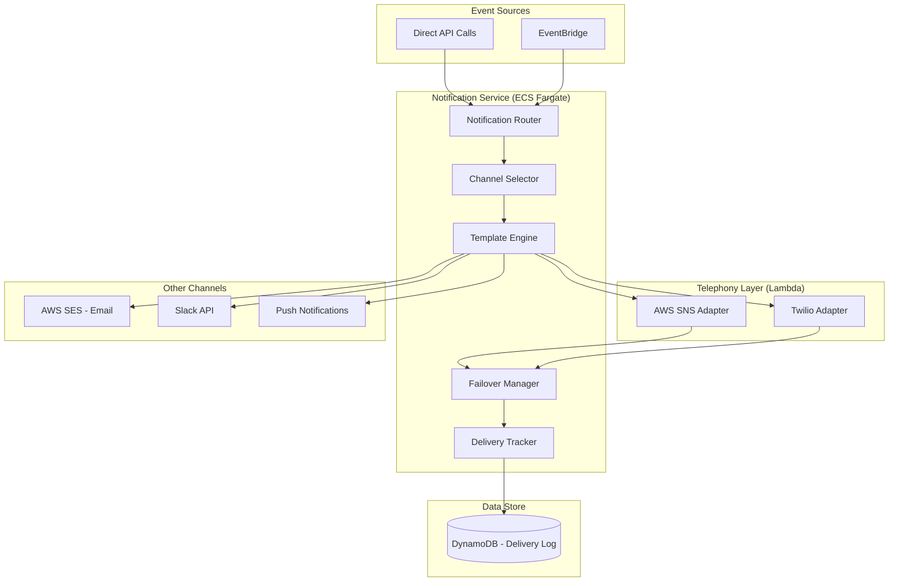
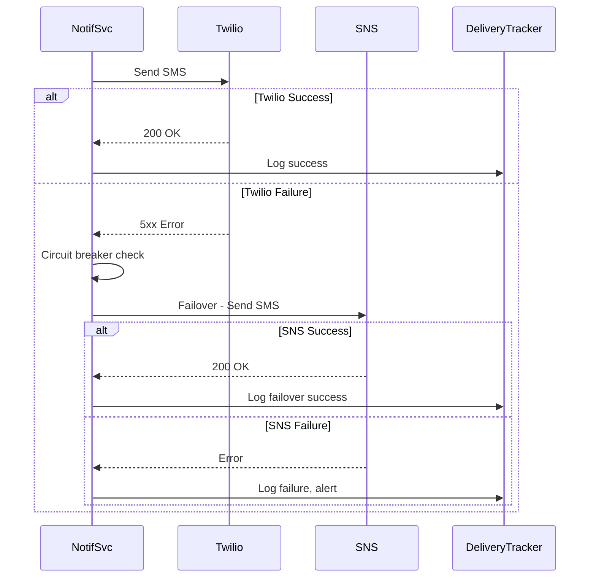

# PD Lite – Notification Service Design

## Overview

The Notification Service handles all outbound communications including paging (SMS/voice), email, push notifications, and chat messages. It provides multi-provider redundancy, delivery tracking, and automatic failover.

---

## Responsibilities

| Responsibility | Description |
|----------------|-------------|
| **Multi-Channel Delivery** | Send via SMS, voice, email, push, Slack |
| **Provider Abstraction** | Unified interface across Twilio, SNS, SES |
| **Failover Management** | Automatic failover on provider failures |
| **Delivery Tracking** | Track send, delivery, and acknowledgement |
| **Rate Limiting** | Prevent notification storms |
| **Quiet Hours** | Respect user preferences (optional) |

---

## Architecture



---

## Channel Priority

For paging during incidents, channels are attempted in priority order:

| Priority | Channel | Use Case |
|----------|---------|----------|
| 1 | SMS | Fast, reliable, low latency |
| 2 | Voice Call | Escalation, ensures wake-up |
| 3 | Push Notification | Mobile app (future) |
| 4 | Email | Non-urgent, documentation |
| 5 | Slack DM | Convenience, not guaranteed |

---

## Data Model

### Notification Event (DynamoDB)

```json
{
  "PK": "INCIDENT#inc_01HXYZ",
  "SK": "NOTIF#2026-01-29T17:00:00Z#notif_abc",
  "notification_id": "notif_abc",
  "incident_id": "inc_01HXYZ",
  "recipient_id": "user_jane",
  "recipient_phone": "+1555000****",  // masked
  "channel": "sms",
  "provider": "twilio",
  "template": "page_responder",
  "status": "delivered",
  "attempts": [
    {
      "attempt": 1,
      "provider": "twilio",
      "status": "delivered",
      "sent_at": "2026-01-29T17:00:01Z",
      "delivered_at": "2026-01-29T17:00:03Z",
      "provider_message_id": "SM..."
    }
  ],
  "acknowledged_at": "2026-01-29T17:00:30Z",
  "created_at": "2026-01-29T17:00:00Z"
}
```

### Notification Status

| Status | Description |
|--------|-------------|
| `pending` | Queued for delivery |
| `sending` | In flight to provider |
| `sent` | Provider accepted |
| `delivered` | Confirmed delivery |
| `failed` | All attempts exhausted |
| `acknowledged` | User responded |

---

## Provider Configuration

### Twilio (Primary SMS/Voice)

```yaml
provider: twilio
channels: [sms, voice]
config:
  account_sid: ${secrets:twilio/account_sid}
  auth_token: ${secrets:twilio/auth_token}
  sms_from: "+15551234567"
  voice_from: "+15551234567"
  twiml_voice_url: "https://api.pdlite.io/v1/twilio/voice"
health_check:
  endpoint: "https://api.twilio.com/healthcheck"
  interval_seconds: 30
circuit_breaker:
  failure_threshold: 5
  reset_timeout_seconds: 60
```

### AWS SNS (Fallback SMS)

```yaml
provider: aws_sns
channels: [sms]
config:
  region: us-east-1
  sender_id: "PDLite"
  message_type: "Transactional"
circuit_breaker:
  failure_threshold: 10
  reset_timeout_seconds: 120
```

---

## Failover Strategy



### Circuit Breaker Rules

| Condition | Action |
|-----------|--------|
| 5 consecutive failures | Trip circuit, switch to secondary |
| 60 seconds elapsed | Half-open, try primary |
| Primary success | Reset circuit |
| Both providers fail | Alert ops, use email backup |

---

## API Design

### Endpoints

| Method | Path | Description |
|--------|------|-------------|
| `POST` | `/v1/notifications` | Send a notification |
| `GET` | `/v1/notifications/{id}` | Get notification status |
| `GET` | `/v1/incidents/{id}/notifications` | List notifications for incident |
| `POST` | `/v1/notifications/{id}/acknowledge` | Acknowledge notification |
| `GET` | `/v1/notifications/health` | Provider health status |

### Example: Send Page

```json
POST /v1/notifications
{
  "incident_id": "inc_01HXYZ",
  "recipient_id": "user_jane",
  "template": "page_responder",
  "channels": ["sms", "voice"],
  "priority": "high",
  "context": {
    "incident_title": "API latency spike",
    "severity": "sev2",
    "ack_url": "https://app.pdlite.io/ack/notif_abc"
  }
}
```

### Example: Delivery Webhook (Twilio)

```json
POST /v1/twilio/webhook
{
  "MessageSid": "SM...",
  "MessageStatus": "delivered",
  "To": "+15550001234"
}
```

---

## Message Templates

### Page Responder (SMS)

```
🚨 [SEV{{severity}}] {{incident_title}}

You've been paged as {{role}}.

Reply ACK to acknowledge.
Details: {{short_url}}
```

### Page Responder (Voice TwiML)

```xml
<?xml version="1.0" encoding="UTF-8"?>
<Response>
  <Say voice="alice">
    Attention. This is PD Lite with a severity {{severity}} incident.
    {{incident_title}}.
    Press 1 to acknowledge.
    Press 2 to escalate.
  </Say>
  <Gather numDigits="1" action="/v1/twilio/gather/{{notification_id}}">
    <Say>Please press 1 or 2.</Say>
  </Gather>
</Response>
```

---

## SLOs

| Metric | Target | Measurement |
|--------|--------|-------------|
| Page initiation | < 5 seconds | Time from event to first send attempt |
| Delivery confirmation | < 30 seconds | Time to delivery status |
| Provider failover | < 60 seconds | Time to detect and switch |
| Acknowledgement processing | < 5 seconds | Time from ack to state update |

---

## Rate Limiting

| Scope | Limit | Purpose |
|-------|-------|---------|
| Per user per hour | 20 pages | Prevent harassment |
| Per incident per minute | 50 notifications | Prevent storms |
| Per tenant per hour | 500 notifications | Cost control |

---

## Events Emitted

| Event | Trigger | Consumers |
|-------|---------|-----------|
| `notification.sent` | Page sent | Timeline |
| `notification.delivered` | Delivery confirmed | Timeline |
| `notification.failed` | All attempts failed | Timeline, Alerting |
| `notification.acknowledged` | User acks | Role Service, Timeline |
| `notification.provider.failover` | Provider switched | Ops alerting |

---

## Resilience

| Failure Mode | Behavior |
|--------------|----------|
| Twilio down | Automatic failover to SNS |
| Both providers down | Email fallback, critical alert |
| DynamoDB unavailable | Write to SQS, retry later |
| Webhook ingestion fails | Twilio retries, idempotent processing |

---

## Observability

| Metric | Description | Alarm |
|--------|-------------|-------|
| `notifications.sent.count` | Pages sent per minute | N/A |
| `notifications.delivery.latency_p99` | Time to deliver | > 30s |
| `notifications.failed.count` | Failed pages | > 0 |
| `notifications.ack.rate` | Ack rate | < 80% (investigate) |
| `provider.circuit.open` | Circuit breaker tripped | Any |

---

## Technology Stack

| Component | Technology |
|-----------|------------|
| Runtime | Node.js 20 (TypeScript) |
| Framework | Fastify |
| Telephony Adapters | Lambda (isolated, fast cold start) |
| Primary SMS/Voice | Twilio |
| Fallback SMS | AWS SNS |
| Email | AWS SES |
| Delivery Store | DynamoDB |
| Container | Docker on ECS Fargate |

---

## Open Questions

1. **International Numbers**: Support for international SMS/voice from day 1? (Yes)
2. **Push Notifications**: Add FCM/APNS for mobile web or defer? Yes, add this.
3. **Quiet Hours**: Implement per-user quiet hours or defer to v2? Defer to v2.
