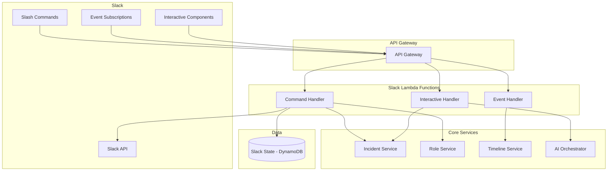
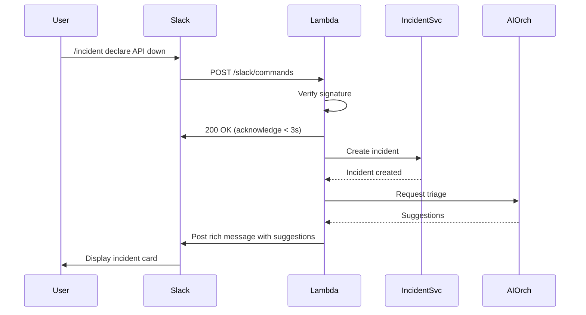

# PD Lite – Slack Integration Service Design

## Overview

The Slack Integration Service is the primary control plane for PD Lite users. It handles slash commands, interactive components, event subscriptions, and channel management. All incident operations can be performed directly from Slack.

---

## Responsibilities

| Responsibility | Description |
|----------------|-------------|
| **Slash Commands** | Handle `/incident`, `/pdlite` commands |
| **Interactive Components** | Process button clicks, modals, dropdowns |
| **Event Handling** | React to channel messages, reactions, membership |
| **Channel Management** | Create/archive incident channels |
| **Home Tab** | Display incident dashboard in Slack |
| **Rich Messaging** | Send formatted blocks with context and actions |

---

## Architecture



---

## Slack App Configuration

### OAuth Scopes

```yaml
bot_scopes:
  - channels:manage        # Create incident channels
  - channels:read          # List channels
  - chat:write             # Send messages
  - commands               # Slash commands
  - groups:write           # Private channel support
  - im:write               # DMs for paging
  - reactions:read         # Track reactions
  - users:read             # User info
  - users:read.email       # Email for user matching
  
user_scopes: []  # No user tokens needed for MVP
```

### Event Subscriptions

```yaml
events:
  - message.channels       # Channel messages
  - message.groups         # Private channel messages
  - reaction_added         # Reaction tracking
  - member_joined_channel  # Responder joins
  - app_home_opened        # Home tab views
```

---

## Slash Commands

### `/incident` Command

| Subcommand | Description | Example |
|------------|-------------|---------|
| `declare` | Start new incident | `/incident declare API latency spike` |
| `status` | Show current status | `/incident status` |
| `severity` | Change severity | `/incident severity sev1` |
| `assign` | Assign role | `/incident assign @jane ic` |
| `update` | Post status update | `/incident update investigating db connections` |
| `resolve` | Resolve incident | `/incident resolve` |
| `help` | Show help | `/incident help` |

### Command Flow



---

## Interactive Components

### Incident Card (Block Kit)

```json
{
  "blocks": [
    {
      "type": "header",
      "text": { "type": "plain_text", "text": "🚨 INC-042: API latency spike" }
    },
    {
      "type": "section",
      "fields": [
        { "type": "mrkdwn", "text": "*Severity:*\nSEV2 🟠" },
        { "type": "mrkdwn", "text": "*Status:*\nInvestigating" },
        { "type": "mrkdwn", "text": "*IC:*\n@jane" },
        { "type": "mrkdwn", "text": "*Duration:*\n15 min" }
      ]
    },
    {
      "type": "context",
      "elements": [
        { "type": "mrkdwn", "text": "📍 *Services:* payment-api | *Channel:* #inc-042-api-latency" }
      ]
    },
    {
      "type": "actions",
      "elements": [
        {
          "type": "button",
          "text": { "type": "plain_text", "text": "Take IC" },
          "action_id": "take_ic",
          "style": "primary"
        },
        {
          "type": "button",
          "text": { "type": "plain_text", "text": "Join as Responder" },
          "action_id": "join_responder"
        },
        {
          "type": "button",
          "text": { "type": "plain_text", "text": "Escalate" },
          "action_id": "escalate",
          "style": "danger"
        }
      ]
    }
  ]
}
```

### AI Suggestion Card

```json
{
  "blocks": [
    {
      "type": "section",
      "text": { "type": "mrkdwn", "text": "🤖 *AI Suggestion:* Change severity to SEV1\n_Confidence: 85%_\n\nReason: Customer-facing payment flow is impacted" }
    },
    {
      "type": "actions",
      "elements": [
        {
          "type": "button",
          "text": { "type": "plain_text", "text": "✓ Accept" },
          "action_id": "accept_suggestion",
          "style": "primary",
          "value": "prop_abc123"
        },
        {
          "type": "button",
          "text": { "type": "plain_text", "text": "✗ Dismiss" },
          "action_id": "dismiss_suggestion",
          "value": "prop_abc123"
        }
      ]
    }
  ]
}
```

---

## Channel Management

### Incident Channel Naming

Format: `#inc-{number}-{slug}`

Example: `#inc-042-api-latency`

### Channel Lifecycle

| Event | Action |
|-------|--------|
| Incident declared | Create channel, invite responders |
| Responder added | Invite to channel |
| IC assigned | Set channel topic |
| Incident resolved | Post summary, archive after 24h |

### Channel Setup

```javascript
async function createIncidentChannel(incident) {
  const channel = await slack.conversations.create({
    name: `inc-${incident.number}-${slugify(incident.title)}`,
    is_private: false
  });
  
  await slack.conversations.setTopic({
    channel: channel.id,
    topic: `SEV${incident.severity} | IC: TBD | Status: ${incident.status}`
  });
  
  await slack.chat.postMessage({
    channel: channel.id,
    blocks: buildIncidentCard(incident)
  });
  
  return channel;
}
```

---

## Event Processing

### Message Events

| Event Type | Processing |
|------------|------------|
| Regular message | Add to timeline as `slack_message` event |
| Thread reply | Associate with parent, add to timeline |
| Bot message | Ignore (prevent loops) |
| Join/leave | Log membership changes |

### Reaction Events

| Reaction | Meaning | Action |
|----------|---------|--------|
| `:white_check_mark:` | Acknowledge | Mark task complete |
| `:eyes:` | Looking into it | Log investigation start |
| `:fire:` | Severity up | Suggest severity increase |
| `:heavy_check_mark:` | Resolved | Suggest resolution |

---

## Data Model

### Slack Workspace State (DynamoDB)

```json
{
  "PK": "TENANT#tenant_abc",
  "SK": "SLACK#T0123456",
  "workspace_id": "T0123456",
  "workspace_name": "Acme Corp",
  "bot_token": "xoxb-...",  // encrypted
  "bot_user_id": "U0BOT123",
  "installed_at": "2026-01-15T10:00:00Z",
  "installed_by": "user_jane",
  "scopes": ["channels:manage", "chat:write", ...]
}
```

### Incident-Channel Mapping

```json
{
  "PK": "INCIDENT#inc_01HXYZ",
  "SK": "SLACK_CHANNEL",
  "channel_id": "C0123456789",
  "channel_name": "inc-042-api-latency",
  "created_at": "2026-01-29T17:00:00Z",
  "archived_at": null
}
```

---

## API Design (Internal)

### Endpoints

| Method | Path | Description |
|--------|------|-------------|
| `POST` | `/slack/commands` | Slash command handler |
| `POST` | `/slack/events` | Event subscription handler |
| `POST` | `/slack/interactive` | Button/modal handler |
| `GET` | `/slack/oauth/callback` | OAuth installation |
| `POST` | `/slack/notify` | Send message (internal) |

### Response Time Requirements

| Endpoint | SLO | Notes |
|----------|-----|-------|
| `/slack/commands` | < 3s | Slack timeout, use deferred response |
| `/slack/events` | < 3s | Acknowledge fast, process async |
| `/slack/interactive` | < 3s | Same pattern |

---

## Resilience

| Failure Mode | Behavior |
|--------------|----------|
| Slack API unavailable | Queue messages, retry with backoff |
| Lambda timeout | Return 200 to prevent Slack retry storm |
| Signature verification fails | Return 401, log attempt |
| Channel creation fails | Proceed without channel, notify user |

### Slack Outage Handling

When Slack is detected as down:
1. Switch to web-first mode
2. Queue all Slack messages
3. Continue incident via web UI
4. Replay queued messages when Slack recovers

---

## Observability

| Metric | Description | Alarm |
|--------|-------------|-------|
| `slack.commands.count` | Commands received | N/A |
| `slack.commands.latency_p99` | Response time | > 2s |
| `slack.api.errors` | API call failures | > 5% |
| `slack.messages.queued` | Messages awaiting send | > 100 |

---

## Technology Stack

| Component | Technology |
|-----------|------------|
| Runtime | Node.js 20 (TypeScript) |
| Framework | Bolt for Slack (official SDK) |
| Deployment | Lambda (commands) + ECS (background) |
| Token Storage | Secrets Manager |
| State Store | DynamoDB |

---

## Open Questions

1. **Multi-workspace**: Support multiple Slack workspaces per tenant?
2. **Private Channels**: Default to private or public incident channels?
3. **Message Threading**: Thread updates under incident card or flat?
4. **User Mapping**: Auto-match Slack users to PD Lite users by email?
