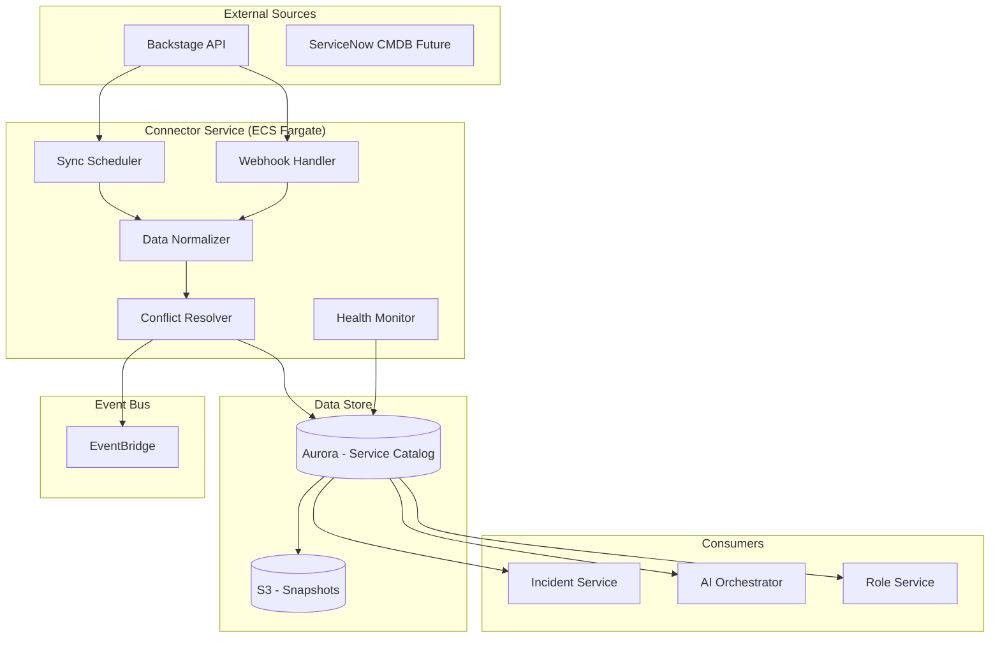
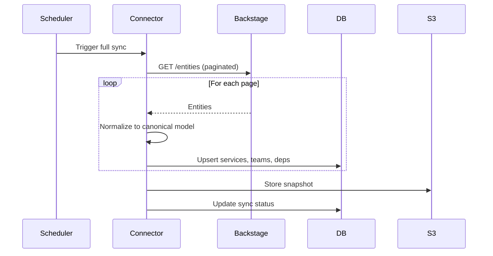
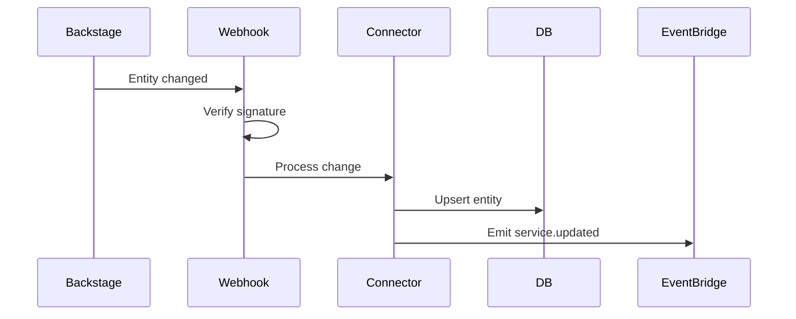

# PD Lite – Service Catalog Connector Design

## Overview

The Service Catalog Connector ingests service metadata from external sources (Backstage, future: ServiceNow) and maintains PD Lite's canonical service model. It provides context for incidents, AI grounding, and responder suggestions.

---

## Responsibilities

| Responsibility | Description |
|----------------|-------------|
| **Data Ingestion** | Sync services, teams, dependencies from external catalogs |
| **Canonical Model** | Normalize data into PD Lite's internal model |
| **Freshness** | Keep data current via webhooks + polling |
| **Conflict Resolution** | Handle overrides and drift detection |
| **Health Monitoring** | Track sync status and errors |

---

## Architecture



---

## Canonical Data Model

### Service

```sql
CREATE TABLE services (
    id              UUID PRIMARY KEY DEFAULT gen_random_uuid(),
    tenant_id       UUID NOT NULL,
    external_id     VARCHAR(255),
    source          VARCHAR(50) NOT NULL,  -- 'backstage', 'manual'
    name            VARCHAR(255) NOT NULL,
    description     TEXT,
    tier            VARCHAR(20),  -- 'tier1', 'tier2', 'tier3'
    owner_team_id   UUID REFERENCES teams(id),
    schedule_id     UUID,  -- on-call schedule
    lifecycle       VARCHAR(50),  -- 'production', 'deprecated'
    tags            JSONB DEFAULT '[]',
    metadata        JSONB DEFAULT '{}',
    synced_at       TIMESTAMPTZ,
    created_at      TIMESTAMPTZ DEFAULT NOW(),
    updated_at      TIMESTAMPTZ DEFAULT NOW(),
    
    UNIQUE(tenant_id, source, external_id)
);
```

### Team

```sql
CREATE TABLE teams (
    id              UUID PRIMARY KEY DEFAULT gen_random_uuid(),
    tenant_id       UUID NOT NULL,
    external_id     VARCHAR(255),
    source          VARCHAR(50) NOT NULL,
    name            VARCHAR(255) NOT NULL,
    email           VARCHAR(255),
    slack_channel   VARCHAR(100),
    members         UUID[],
    metadata        JSONB DEFAULT '{}',
    synced_at       TIMESTAMPTZ,
    created_at      TIMESTAMPTZ DEFAULT NOW()
);
```

### Service Dependency

```sql
CREATE TABLE service_dependencies (
    id              UUID PRIMARY KEY DEFAULT gen_random_uuid(),
    service_id      UUID NOT NULL REFERENCES services(id),
    depends_on_id   UUID NOT NULL REFERENCES services(id),
    dependency_type VARCHAR(50) DEFAULT 'runtime',  -- 'runtime', 'build', 'data'
    is_critical     BOOLEAN DEFAULT FALSE,
    source          VARCHAR(50) NOT NULL,
    
    UNIQUE(service_id, depends_on_id)
);
```

### Runbook Link

```sql
CREATE TABLE service_runbooks (
    id              UUID PRIMARY KEY DEFAULT gen_random_uuid(),
    service_id      UUID NOT NULL REFERENCES services(id),
    title           VARCHAR(255) NOT NULL,
    url             TEXT NOT NULL,
    runbook_type    VARCHAR(50),  -- 'incident', 'deployment', 'troubleshooting'
    source          VARCHAR(50) NOT NULL
);
```

---

## Connector Configuration

### Backstage Connector Config

```yaml
connector_id: backstage-prod
type: backstage
enabled: true

connection:
  base_url: "https://backstage.internal.acme.com"
  auth:
    type: bearer_token
    secret_ref: "secrets/backstage-token"

sync:
  schedule: "*/15 * * * *"  # Every 15 minutes
  full_sync_schedule: "0 2 * * *"  # Daily at 2 AM
  
entity_types:
  - component
  - system
  - api
  - resource

field_mapping:
  name: "metadata.name"
  description: "metadata.description"
  owner_team: "spec.owner"
  tier: "metadata.annotations['acme.com/tier']"
  lifecycle: "spec.lifecycle"
  
dependency_extraction:
  upstream: "spec.dependsOn"
  downstream: "relations[?type=='dependencyOf'].targetRef"

filters:
  - "spec.lifecycle != 'deprecated'"
  - "metadata.annotations['acme.com/pdlite-enabled'] == 'true'"
```

---

## Sync Strategies

### Initial Full Sync



### Incremental Sync (Webhook)



---

## API Design

### Endpoints

| Method | Path | Description |
|--------|------|-------------|
| `GET` | `/v1/services` | List services |
| `GET` | `/v1/services/{id}` | Get service details |
| `GET` | `/v1/services/{id}/dependencies` | Get dependencies |
| `GET` | `/v1/services/{id}/on-call` | Get current on-call |
| `POST` | `/v1/services/{id}/override` | Manual field override |
| `GET` | `/v1/connectors` | List connectors |
| `GET` | `/v1/connectors/{id}/status` | Connector health |
| `POST` | `/v1/connectors/{id}/sync` | Trigger manual sync |

### Example: Get Service

```json
GET /v1/services/svc_payment_api

{
  "id": "svc_payment_api",
  "name": "payment-api",
  "description": "Handles payment processing",
  "tier": "tier1",
  "owner": {
    "team_id": "team_payments",
    "name": "Payments Team",
    "slack_channel": "#team-payments"
  },
  "on_call": {
    "user_id": "user_jane",
    "name": "Jane Smith",
    "until": "2026-01-30T09:00:00Z"
  },
  "dependencies": {
    "upstream": ["stripe-gateway", "database-primary"],
    "downstream": ["checkout-web", "mobile-app"]
  },
  "runbooks": [
    { "title": "Latency troubleshooting", "url": "..." }
  ],
  "source": "backstage",
  "synced_at": "2026-01-29T16:45:00Z"
}
```

---

## Resilience

| Failure Mode | Behavior |
|--------------|----------|
| Backstage unavailable | Use last-known-good snapshot |
| Sync fails | Retry with backoff, alert after 3 failures |
| Partial sync | Transaction rollback, preserve previous state |
| Webhook flood | Rate limit, queue excess |

---

## Observability

| Metric | Description | Alarm |
|--------|-------------|-------|
| `connector.sync.success` | Successful syncs | N/A |
| `connector.sync.failures` | Failed syncs | > 0 for 1 hour |
| `connector.sync.latency` | Sync duration | > 5 min |
| `connector.entities.count` | Total entities synced | Drift > 20% |
| `connector.staleness` | Time since last sync | > 30 min |

---

## Technology Stack

| Component | Technology |
|-----------|------------|
| Runtime | Node.js 20 (TypeScript) |
| Scheduler | EventBridge Scheduler |
| Data Store | Aurora PostgreSQL |
| Snapshots | S3 |
| Container | Docker on ECS Fargate |

---

## Open Questions

1. **Multi-source**: How to reconcile same service from multiple sources?
2. **Manual Services**: Support manually-created services for teams without Backstage?
3. **Schedule Integration**: Import on-call from PagerDuty schedules during migration?
