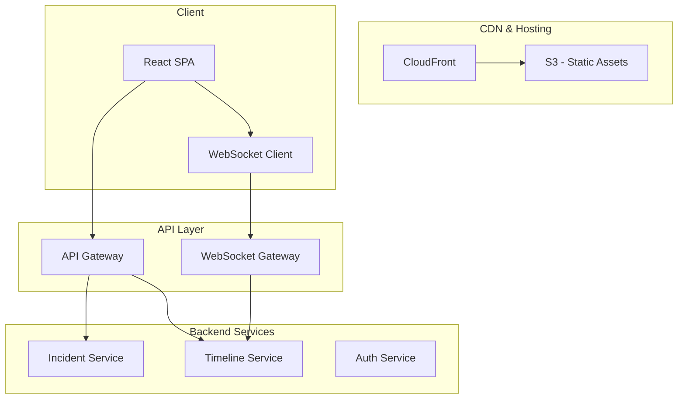
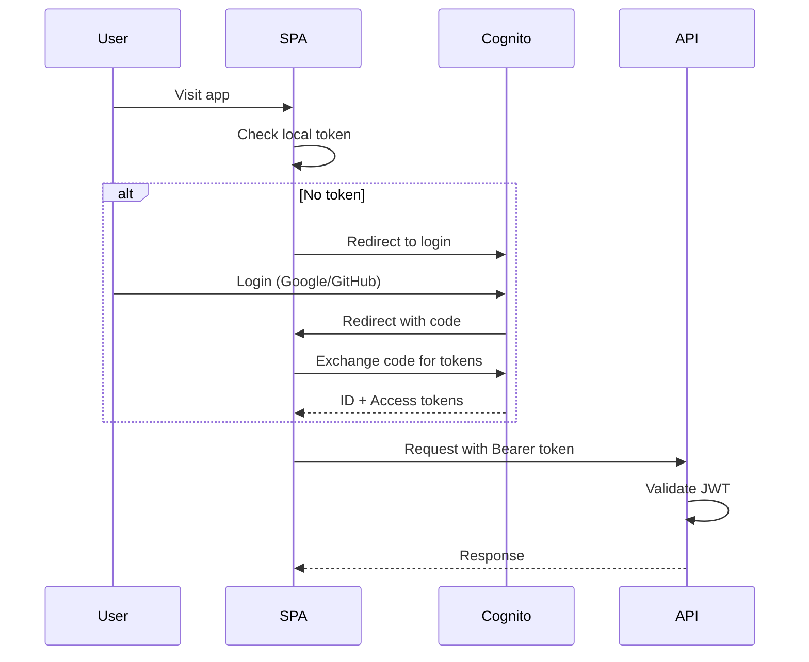
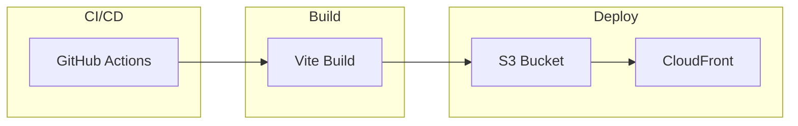

# PD Lite – Web UI Architecture

## Overview

The Web UI serves as the secondary control plane for PD Lite, providing a fallback when Slack is unavailable and a richer view for incident management, admin configuration, and post-incident review.

---

## Responsibilities

| Responsibility | Description |
|----------------|-------------|
| **Incident Dashboard** | View and manage active/recent incidents |
| **Incident Detail View** | Full timeline, roles, AI suggestions |
| **Admin Console** | Configuration, connectors, integrations |
| **Onboarding Flow** | Guided setup for new tenants |
| **Mobile Responsiveness** | Functional on mobile browsers |

---

## Architecture



---

## Technology Stack

| Component | Technology | Rationale |
|-----------|------------|-----------|
| **Framework** | React 18 + TypeScript | Industry standard, large ecosystem |
| **Routing** | React Router v6 | Client-side routing |
| **State** | TanStack Query | Server state, caching, real-time |
| **UI Library** | Radix UI + custom | Accessible primitives, custom design |
| **Styling** | Tailwind CSS | Rapid iteration, consistent design |
| **Build** | Vite | Fast builds, HMR |
| **Real-time** | WebSocket (native) | Live timeline updates |

---

## Core Pages

### 1. Dashboard (`/incidents`)

| Element | Description |
|---------|-------------|
| Active incidents | Cards showing ongoing incidents |
| Recent incidents | Table of last 20 resolved |
| Quick stats | Open count, MTTR, acknowledgement rate |
| Quick actions | Declare incident button |

### 2. Incident Detail (`/incidents/:id`)

| Section | Content |
|---------|---------|
| Header | Title, severity badge, status, duration |
| Timeline | Real-time event stream |
| Roles panel | IC, responders with contact |
| AI panel | Pending suggestions, accept/reject |
| Service context | Affected services, dependencies |
| Actions | Escalate, update, resolve buttons |

### 3. Admin Console (`/admin`)

| Tab | Features |
|-----|----------|
| Integrations | Slack status, Backstage connector |
| Notifications | Test page, delivery health |
| Team | User list, role defaults |
| Settings | AI toggles, retention |

### 4. Onboarding (`/setup`)

| Step | Content |
|------|---------|
| 1 | Slack installation |
| 2 | Phone verification |
| 3 | Optional: Backstage setup |
| 4 | Test incident walkthrough |

---

## Component Library

### Design Tokens

```css
:root {
  /* Colors */
  --color-sev1: #dc2626;  /* Red */
  --color-sev2: #f97316;  /* Orange */
  --color-sev3: #eab308;  /* Yellow */
  --color-sev4: #22c55e;  /* Green */
  
  /* Status */
  --color-declared: #3b82f6;
  --color-investigating: #f97316;
  --color-mitigating: #eab308;
  --color-resolved: #22c55e;
  
  /* Semantic */
  --color-ai-suggestion: #8b5cf6;
  --color-human-action: #06b6d4;
}
```

### Core Components

| Component | Purpose |
|-----------|---------|
| `<IncidentCard>` | Summary card for incident |
| `<SeverityBadge>` | SEV1-4 colored badge |
| `<StatusBadge>` | Status with icon |
| `<TimelineEvent>` | Single timeline entry |
| `<AIProposal>` | Suggestion with accept/reject |
| `<RoleChip>` | User with role indicator |
| `<ServiceCard>` | Service with context |

---

## Real-time Updates

### WebSocket Connection

```typescript
// Connect to WebSocket for live updates
const ws = new WebSocket(`wss://ws.pdlite.io/incidents/${incidentId}`);

ws.onmessage = (event) => {
  const data = JSON.parse(event.data);
  
  switch (data.type) {
    case 'timeline.event':
      queryClient.setQueryData(['timeline', incidentId], (old) => 
        [...old, data.event]
      );
      break;
    case 'incident.updated':
      queryClient.invalidateQueries(['incident', incidentId]);
      break;
    case 'ai.proposal':
      showToast('New AI suggestion available');
      break;
  }
};
```

### Optimistic Updates

```typescript
const updateIncident = useMutation({
  mutationFn: (update) => api.updateIncident(id, update),
  onMutate: async (update) => {
    // Cancel outgoing refetches
    await queryClient.cancelQueries(['incident', id]);
    
    // Snapshot previous value
    const previous = queryClient.getQueryData(['incident', id]);
    
    // Optimistically update
    queryClient.setQueryData(['incident', id], (old) => ({
      ...old,
      ...update
    }));
    
    return { previous };
  },
  onError: (err, update, context) => {
    // Rollback on error
    queryClient.setQueryData(['incident', id], context.previous);
  }
});
```

---

## Authentication Flow



---

## Routing Structure

```typescript
const routes = [
  { path: '/', element: <Navigate to="/incidents" /> },
  { path: '/incidents', element: <IncidentDashboard /> },
  { path: '/incidents/:id', element: <IncidentDetail /> },
  { path: '/services', element: <ServiceCatalog /> },
  { path: '/services/:id', element: <ServiceDetail /> },
  { path: '/admin', element: <AdminLayout />, children: [
    { path: 'integrations', element: <Integrations /> },
    { path: 'notifications', element: <Notifications /> },
    { path: 'team', element: <Team /> },
    { path: 'settings', element: <Settings /> },
  ]},
  { path: '/setup', element: <OnboardingFlow /> },
  { path: '/login', element: <Login /> },
];
```

---

## Accessibility

| Requirement | Implementation |
|-------------|----------------|
| Keyboard navigation | Focus management, skip links |
| Screen readers | ARIA labels, live regions for updates |
| Color contrast | WCAG AA compliance |
| Reduced motion | Respect `prefers-reduced-motion` |

---

## Performance

| Target | Metric |
|--------|--------|
| First Contentful Paint | < 1.5s |
| Time to Interactive | < 3s |
| Lighthouse Score | > 90 |
| Bundle Size (gzipped) | < 200KB initial |

### Optimization Strategies

- Code splitting by route
- Lazy load admin components
- Preload critical fonts
- Service worker for offline shell
- Edge caching via CloudFront

---

## Deployment



### CloudFront Configuration

| Setting | Value |
|---------|-------|
| Origin | S3 bucket (private) |
| Default TTL | 1 day (static assets) |
| Index page | `/index.html` |
| Error pages | Redirect 404 → `/index.html` |
| Headers | Security headers via response policy |

---

## Open Questions

1. **Dark Mode**: Support dark mode from launch or v2?
2. **PWA**: Enable offline capabilities and install prompt?
3. **Keyboard Shortcuts**: Vim-style navigation for power users?
