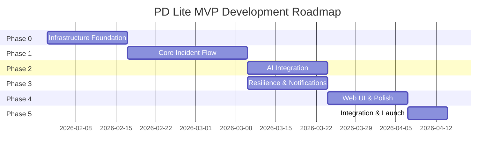
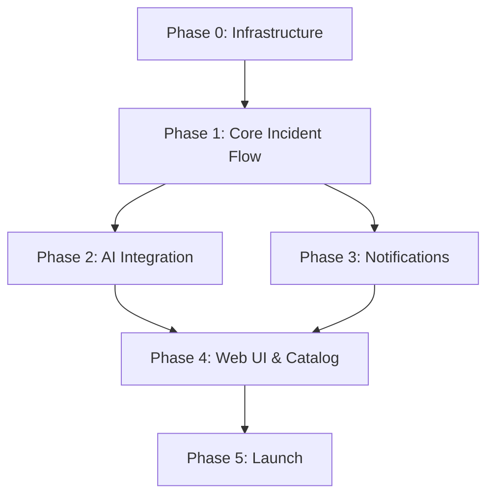

# PD Lite – Development Roadmap

## Overview

This roadmap defines the prioritized build order for PD Lite MVP, organized into phases with clear milestones and dependencies. Target: **MVP launch in 12 weeks**.

---

## Phase Summary

---

## Phase 0: Infrastructure Foundation (Weeks 1-2)

**Goal:** AWS infrastructure ready for service deployment

### Deliverables

| Component | Description | Owner |
|-----------|-------------|-------|
| Terraform modules | VPC, subnets, security groups | Infra |
| ECS cluster | Fargate cluster with service mesh | Infra |
| Aurora PostgreSQL | Serverless v2 cluster | Infra |
| DynamoDB tables | Events, timeline, notifications | Infra |
| Cognito | User pool with Google/GitHub | Infra |
| Secrets Manager | Secret storage pattern | Infra |
| EventBridge | Event bus configuration | Infra |
| CI/CD skeleton | GitHub Actions → ECR → ECS | Infra |

### Milestone: Infrastructure Ready
- [ ] VPC with public/private subnets deployed
- [ ] ECS cluster accepting deployments
- [ ] Databases provisioned and accessible
- [ ] CI/CD deploys a "hello world" service

### Dependencies
- AWS account with appropriate permissions
- Domain name for API and web

---

## Phase 1: Core Incident Flow (Weeks 3-5)

**Goal:** End-to-end incident lifecycle via Slack

### Week 3: Incident Lifecycle Service

| Task | Description |
|------|-------------|
| Data model | Incidents, events schema in Aurora + DynamoDB |
| State machine | XState-based incident state management |
| REST API | CRUD endpoints for incidents |
| Event emission | Publish to EventBridge |

### Week 4: Slack Integration

| Task | Description |
|------|-------------|
| Slack app | OAuth flow, bot token storage |
| `/incident declare` | Create incident from Slack |
| Incident channel | Auto-create #inc-XXX channel |
| Basic responses | Incident cards with Block Kit |

### Week 5: Timeline & Roles

| Task | Description |
|------|-------------|
| Timeline service | Append-only event log |
| Role service | IC assignment, responders |
| Slack updates | Role changes reflected in channel |
| Basic escalation | Simple page-on-declare |

### Milestone: Declare-to-Resolve Flow
- [ ] `/incident declare` creates incident
- [ ] Slack channel created with incident card
- [ ] IC can be assigned
- [ ] `/incident resolve` closes incident
- [ ] Timeline captures all events

### Dependencies
- Phase 0 infrastructure complete

---

## Phase 2: AI Integration (Weeks 6-7)

**Goal:** AI copilot suggesting severity, responders, and updates

### Week 6: AI Orchestrator

| Task | Description |
|------|-------------|
| Bedrock setup | Claude 3 Sonnet/Haiku access |
| Context builder | Assemble incident + service context |
| Triage agent | Severity + responder suggestions |
| Proposal store | Store suggestions, track decisions |

### Week 7: AI in Slack

| Task | Description |
|------|-------------|
| Suggestion cards | Display AI proposals in Slack |
| Accept/reject | Buttons to action proposals |
| Guardrails | Enforce AI behavior contract |
| Comms agent | Draft status updates |

### Milestone: AI-Assisted Incidents
- [ ] AI suggests severity on incident declare
- [ ] AI suggests responders
- [ ] Suggestions appear in Slack with accept/reject
- [ ] No autonomous actions (guardrails enforced)

### Dependencies
- Phase 1 incident flow complete
- Bedrock model access approved

---

## Phase 3: Resilience & Notifications (Weeks 6-7, parallel to Phase 2)

**Goal:** Reliable paging with failover

### Week 6: Notification Service

| Task | Description |
|------|-------------|
| Twilio integration | SMS and voice paging |
| Delivery tracking | Store attempts, confirmations |
| Acknowledgement | Reply-based ack for SMS |
| Voice IVR | Basic TwiML for voice pages |

### Week 7: Failover & Escalation

| Task | Description |
|------|-------------|
| SNS fallback | Secondary SMS provider |
| Circuit breaker | Auto-failover on Twilio errors |
| Escalation engine | Time-based escalation steps |
| Push notifications | FCM/APNS integration |

### Milestone: Reliable Paging
- [ ] SMS pages delivered in <30 seconds
- [ ] Voice calls with IVR acknowledgement
- [ ] Automatic failover to SNS on Twilio failure
- [ ] Escalation after non-acknowledgement

### Dependencies
- Twilio account provisioned
- Phone numbers acquired
- FCM/APNS credentials

---

## Phase 4: Web UI & Service Catalog (Weeks 8-9)

**Goal:** Web fallback and service context

### Week 8: Web UI Core

| Task | Description |
|------|-------------|
| React app scaffold | Vite + React + TanStack Query |
| Auth flow | Cognito integration |
| Incident dashboard | List active/recent incidents |
| Incident detail | Timeline, roles, actions |
| Dark mode | Theme support |

### Week 9: Service Catalog & Polish

| Task | Description |
|------|-------------|
| Backstage connector | Sync services, teams, deps |
| Service context panel | Show in Slack + Web |
| Admin console | Settings, integrations status |
| Onboarding flow | Guided setup for new tenants |

### Milestone: Full MVP UX
- [ ] Web UI functional as Slack fallback
- [ ] Services from Backstage appear in incidents
- [ ] New tenant can onboard in <15 minutes
- [ ] Dark mode works

### Dependencies
- Phase 2 AI integration (for AI panel in web)
- Phase 3 notifications (for delivery status)

---

## Phase 5: Integration & Launch (Weeks 10-12)

**Goal:** Production-ready, tested, documented

### Week 10: End-to-End Testing

| Task | Description |
|------|-------------|
| Integration tests | Full incident lifecycle |
| Chaos testing | Simulate Slack/Twilio outages |
| Load testing | 100 concurrent incidents |
| Security review | Pen test, dependency audit |

### Week 11: Operational Readiness

| Task | Description |
|------|-------------|
| Monitoring | CloudWatch dashboards, alarms |
| Runbooks | Ops procedures for PD Lite itself |
| Dogfooding | Use PD Lite for PD Lite incidents |
| Documentation | API docs, user guides |

### Week 12: Launch Prep

| Task | Description |
|------|-------------|
| Design partner onboarding | 2-3 early customers |
| Feedback iteration | Quick fixes from feedback |
| Production hardening | Final security, performance |
| Launch! | Public availability |

### Milestone: MVP Launch
- [ ] 3 design partners actively using
- [ ] All SLOs met for 1 week
- [ ] Zero critical bugs
- [ ] Documentation complete

---

## Dependency Graph

---

## Team Allocation (Suggested)

| Role | Phase 0-1 | Phase 2-3 | Phase 4-5 |
|------|-----------|-----------|-----------|
| **Backend 1** | Infra + Incident Service | AI Orchestrator | Testing + Ops |
| **Backend 2** | Slack Integration | Notifications | Backstage Connector |
| **Frontend** | — | — | Web UI |
| **Founder/PM** | Requirements, Slack app setup | Design partner outreach | Launch coordination |

---

## Risk Register

| Risk | Impact | Mitigation |
|------|--------|------------|
| Bedrock quota limits | AI features delayed | Apply for quota increase early |
| Twilio international coverage | Paging gaps | Pre-verify target countries |
| Slack app approval | Launch delayed | Submit for review in Week 4 |
| Backstage API changes | Connector breaks | Pin API version, monitor |

---

## Success Criteria (MVP)

| Metric | Target |
|--------|--------|
| Time to first incident | < 15 minutes from signup |
| Page delivery latency | < 30 seconds |
| AI suggestion acceptance | > 60% |
| Slack command response | < 1 second |
| Uptime | 99.9% |

---

## Next Steps

1. **Finalize team allocation** — Who's building what?
2. **Start Phase 0** — Terraform infrastructure
3. **Set up project tracking** — GitHub Projects or Linear
4. **Provision external accounts** — Twilio, Slack developer app
