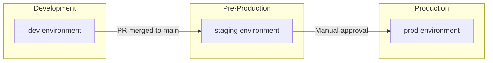
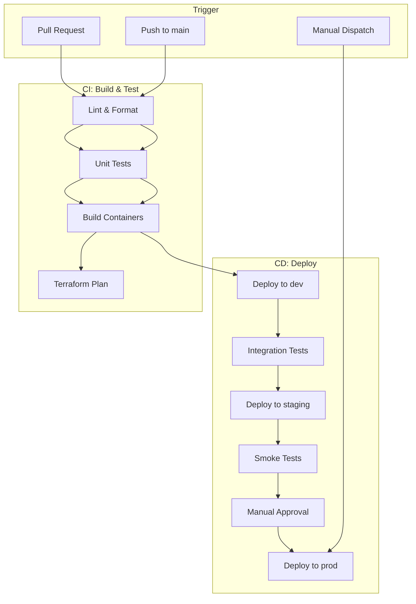

# PD Lite – Environments & CI/CD Pipeline

## Overview

This document defines the environment strategy and CI/CD pipeline for PD Lite, optimized for a solo developer workflow with fast iteration and safe production deployments.

---

## Environment Strategy

### Three Environments

| Environment | Purpose | AWS Account | Cost Strategy |
|-------------|---------|-------------|---------------|
| **dev** | Active development, experimentation | Shared | Scale to zero, minimal resources |
| **staging** | Pre-production validation, design partner demos | Shared | Mirror prod config, lower capacity |
| **prod** | Production workloads | Separate (recommended) | Full capacity, multi-AZ |



---

## AWS Account Strategy

### Option A: Single Account (Simpler, Recommended for MVP)

```
AWS Account: pd-lite-main
├── dev/      (resources tagged env=dev)
├── staging/  (resources tagged env=staging)
└── prod/     (resources tagged env=prod)
```

**Pros:** Simpler IAM, lower overhead, easier cross-env debugging  
**Cons:** Blast radius, accidental prod access

### Option B: Multi-Account (More Secure, Post-MVP)

```
AWS Organization
├── pd-lite-dev      (dev + staging)
└── pd-lite-prod     (production only)
```

**Recommendation:** Start with Option A (single account with tags), migrate to Option B when you have paying customers.

---

## Environment Configuration

### Resource Sizing

| Resource | dev | staging | prod |
|----------|-----|---------|------|
| ECS Tasks (per service) | 1 | 1 | 2 (min) |
| ECS CPU/Memory | 256/512 | 512/1024 | 512/1024 |
| Aurora ACUs | 0.5-2 | 0.5-4 | 2-16 |
| DynamoDB | On-demand | On-demand | On-demand |
| Multi-AZ | No | No | Yes |

### Domain Names

| Environment | API | Web | Slack Callback |
|-------------|-----|-----|----------------|
| dev | `api.dev.pdlite.io` | `app.dev.pdlite.io` | `slack.dev.pdlite.io` |
| staging | `api.staging.pdlite.io` | `app.staging.pdlite.io` | `slack.staging.pdlite.io` |
| prod | `api.pdlite.io` | `app.pdlite.io` | `slack.pdlite.io` |

---

## CI/CD Pipeline

### Tool: GitHub Actions

**Why GitHub Actions:**
- Native GitHub integration
- Free tier generous for solo developer
- Great Terraform and AWS support
- Easy secret management

### Pipeline Architecture



---

## GitHub Actions Workflows

### 1. CI Workflow (Pull Requests)

**File:** `.github/workflows/ci.yml`

```yaml
name: CI

on:
  pull_request:
    branches: [main]

jobs:
  lint:
    runs-on: ubuntu-latest
    steps:
      - uses: actions/checkout@v4
      - uses: actions/setup-node@v4
        with:
          node-version: '20'
      - run: npm ci
      - run: npm run lint
      - run: npm run format:check

  test:
    runs-on: ubuntu-latest
    steps:
      - uses: actions/checkout@v4
      - uses: actions/setup-node@v4
        with:
          node-version: '20'
      - run: npm ci
      - run: npm test

  build:
    runs-on: ubuntu-latest
    steps:
      - uses: actions/checkout@v4
      - uses: docker/setup-buildx-action@v3
      - run: docker build -t pd-lite-test .

  terraform-plan:
    runs-on: ubuntu-latest
    steps:
      - uses: actions/checkout@v4
      - uses: hashicorp/setup-terraform@v3
      - run: terraform init
        working-directory: ./terraform/environments/dev
      - run: terraform plan -no-color
        working-directory: ./terraform/environments/dev
```

### 2. Deploy Workflow (Push to Main)

**File:** `.github/workflows/deploy.yml`

```yaml
name: Deploy

on:
  push:
    branches: [main]
  workflow_dispatch:
    inputs:
      environment:
        description: 'Environment to deploy'
        required: true
        default: 'dev'
        type: choice
        options: [dev, staging, prod]

env:
  AWS_REGION: us-east-1

jobs:
  build:
    runs-on: ubuntu-latest
    outputs:
      image_tag: ${{ steps.meta.outputs.tags }}
    steps:
      - uses: actions/checkout@v4
      
      - uses: aws-actions/configure-aws-credentials@v4
        with:
          role-to-assume: ${{ secrets.AWS_ROLE_ARN }}
          aws-region: ${{ env.AWS_REGION }}
      
      - uses: aws-actions/amazon-ecr-login@v2
        id: ecr
      
      - uses: docker/metadata-action@v5
        id: meta
        with:
          images: ${{ steps.ecr.outputs.registry }}/pd-lite
          tags: |
            type=sha,prefix=
            type=raw,value=latest
      
      - uses: docker/build-push-action@v5
        with:
          push: true
          tags: ${{ steps.meta.outputs.tags }}
          cache-from: type=gha
          cache-to: type=gha,mode=max

  deploy-dev:
    needs: build
    runs-on: ubuntu-latest
    environment: dev
    steps:
      - uses: actions/checkout@v4
      
      - uses: aws-actions/configure-aws-credentials@v4
        with:
          role-to-assume: ${{ secrets.AWS_ROLE_ARN }}
          aws-region: ${{ env.AWS_REGION }}
      
      - uses: hashicorp/setup-terraform@v3
      
      - name: Terraform Apply
        run: |
          terraform init
          terraform apply -auto-approve -var="image_tag=${{ needs.build.outputs.image_tag }}"
        working-directory: ./terraform/environments/dev

  deploy-staging:
    needs: [build, deploy-dev]
    runs-on: ubuntu-latest
    environment: staging
    steps:
      - uses: actions/checkout@v4
      
      - uses: aws-actions/configure-aws-credentials@v4
        with:
          role-to-assume: ${{ secrets.AWS_ROLE_ARN }}
          aws-region: ${{ env.AWS_REGION }}
      
      - uses: hashicorp/setup-terraform@v3
      
      - name: Terraform Apply
        run: |
          terraform init
          terraform apply -auto-approve -var="image_tag=${{ needs.build.outputs.image_tag }}"
        working-directory: ./terraform/environments/staging

  deploy-prod:
    needs: [build, deploy-staging]
    runs-on: ubuntu-latest
    environment: 
      name: prod
      url: https://app.pdlite.io
    steps:
      - uses: actions/checkout@v4
      
      - uses: aws-actions/configure-aws-credentials@v4
        with:
          role-to-assume: ${{ secrets.AWS_ROLE_ARN_PROD }}
          aws-region: ${{ env.AWS_REGION }}
      
      - uses: hashicorp/setup-terraform@v3
      
      - name: Terraform Apply
        run: |
          terraform init
          terraform apply -auto-approve -var="image_tag=${{ needs.build.outputs.image_tag }}"
        working-directory: ./terraform/environments/prod
```

---

## Terraform Structure

```
terraform/
├── modules/
│   ├── vpc/
│   ├── ecs-cluster/
│   ├── ecs-service/
│   ├── aurora/
│   ├── dynamodb/
│   ├── cognito/
│   └── api-gateway/
├── environments/
│   ├── dev/
│   │   ├── main.tf
│   │   ├── variables.tf
│   │   └── terraform.tfvars
│   ├── staging/
│   │   └── ...
│   └── prod/
│       └── ...
└── shared/
    └── backend.tf    # S3 backend config
```

### Terraform State

| Component | Storage |
|-----------|---------|
| State file | S3 bucket `pdlite-terraform-state` |
| State lock | DynamoDB table `pdlite-terraform-lock` |
| Workspaces | One per environment |

---

## Secrets Management

### GitHub Secrets

| Secret | Description |
|--------|-------------|
| `AWS_ROLE_ARN` | OIDC role for dev/staging |
| `AWS_ROLE_ARN_PROD` | OIDC role for prod (separate) |
| `SLACK_SIGNING_SECRET` | Per-environment Slack app |
| `TWILIO_AUTH_TOKEN` | Twilio API credentials |

### AWS Secrets Manager

| Secret Path | Contents |
|-------------|----------|
| `pdlite/{env}/slack` | Bot token, signing secret |
| `pdlite/{env}/twilio` | Account SID, auth token |
| `pdlite/{env}/database` | Aurora credentials |

---

## GitHub Environments

Configure these in **Settings → Environments**:

| Environment | Protection Rules |
|-------------|------------------|
| `dev` | None (auto-deploy) |
| `staging` | None (auto-deploy after dev) |
| `prod` | Required reviewer (you), wait 5 min after staging |

---

## Deployment Flow (Solo Developer)

### Daily Development

```
1. Create feature branch
2. Make changes, push
3. PR opened → CI runs (lint, test, plan)
4. Merge to main
5. Auto-deploy to dev
6. Auto-deploy to staging
7. Review staging
8. Click "Approve" → Deploy to prod
```

### Hotfix Flow

```
1. Create hotfix branch from main
2. Make fix, push
3. PR → quick review
4. Merge to main
5. Use workflow_dispatch to deploy directly to prod if urgent
```

---

## Cost Optimization

| Strategy | Savings |
|----------|---------|
| Aurora Serverless scales to 0.5 ACU | ~$50/month in dev |
| ECS tasks scale to 0 in dev (optional) | ~$30/month |
| Use spot instances for CI runners | ~$10/month |
| Single NAT Gateway in dev/staging | ~$60/month |

**Estimated monthly CI/CD cost:** ~$5-10 (GitHub Actions free tier + S3/DynamoDB for state)

---

## Monitoring Deployments

### Slack Notifications

Add to workflows:
```yaml
- name: Notify Slack
  uses: slackapi/slack-github-action@v1
  with:
    payload: |
      {
        "text": "Deployed ${{ github.sha }} to ${{ github.event.inputs.environment }}"
      }
  env:
    SLACK_WEBHOOK_URL: ${{ secrets.SLACK_DEPLOY_WEBHOOK }}
```

### Rollback

```bash
# Quick rollback via Terraform
cd terraform/environments/prod
terraform apply -var="image_tag=<previous-sha>"
```

---

## Setup Checklist

- [ ] Create S3 bucket for Terraform state
- [ ] Create DynamoDB table for state locking
- [ ] Configure AWS OIDC provider for GitHub Actions
- [ ] Create IAM roles for each environment
- [ ] Set up GitHub environments with protection rules
- [ ] Add secrets to GitHub repository
- [ ] Create initial Terraform modules
- [ ] Test full pipeline with hello-world service
