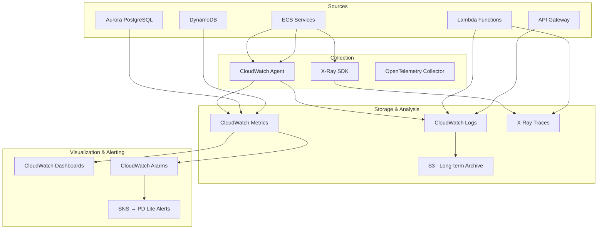
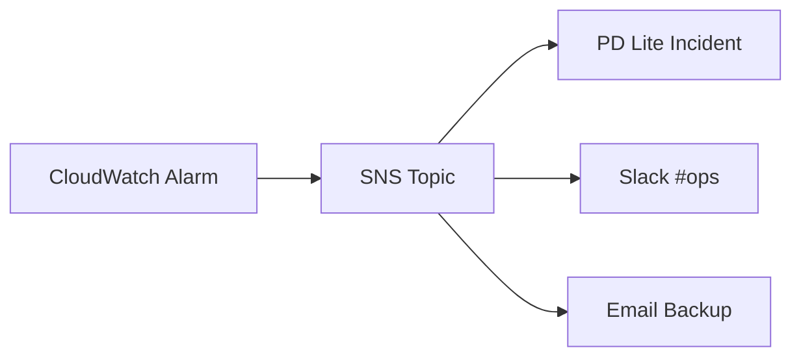

# PD Lite – Observability (MELT) Strategy

## Overview

This document defines the observability strategy for PD Lite, covering **M**etrics, **E**vents, **L**ogs, and **T**races. The goal is to ensure PD Lite can monitor itself effectively—we're building an incident management platform, so our own observability must be exemplary.

---

## MELT Stack



---

## Metrics

### Custom Application Metrics

| Metric | Type | Labels | Description |
|--------|------|--------|-------------|
| `pdlite.incidents.declared` | Counter | `severity`, `source` | New incidents |
| `pdlite.incidents.resolved` | Counter | `severity` | Resolved incidents |
| `pdlite.incidents.active` | Gauge | `severity` | Currently open |
| `pdlite.incidents.mttr_seconds` | Histogram | `severity` | Time to resolution |
| `pdlite.pages.sent` | Counter | `channel`, `provider` | Pages sent |
| `pdlite.pages.delivered` | Counter | `channel`, `provider` | Pages confirmed delivered |
| `pdlite.pages.acknowledged` | Counter | `channel` | Pages acknowledged |
| `pdlite.pages.latency_ms` | Histogram | `channel`, `provider` | Delivery latency |
| `pdlite.ai.proposals.generated` | Counter | `agent` | AI suggestions created |
| `pdlite.ai.proposals.accepted` | Counter | `agent` | AI suggestions accepted |
| `pdlite.ai.latency_ms` | Histogram | `agent` | AI response time |
| `pdlite.slack.commands` | Counter | `command` | Slash commands received |
| `pdlite.api.requests` | Counter | `method`, `path`, `status` | API requests |
| `pdlite.api.latency_ms` | Histogram | `method`, `path` | API response time |

### Infrastructure Metrics (AWS Native)

| Source | Key Metrics |
|--------|-------------|
| **ECS** | CPU, memory, running tasks, task health |
| **Aurora** | Connections, queries, latency, ACU usage |
| **DynamoDB** | Read/write units, throttles, latency |
| **API Gateway** | 4xx/5xx errors, latency, request count |
| **Lambda** | Invocations, duration, errors, cold starts |

### Metric Publishing

```typescript
// Using AWS SDK for CloudWatch
import { CloudWatch } from '@aws-sdk/client-cloudwatch';

const cloudwatch = new CloudWatch({ region: 'us-east-1' });

async function publishMetric(name: string, value: number, dimensions: Record<string, string>) {
  await cloudwatch.putMetricData({
    Namespace: 'PDLite',
    MetricData: [{
      MetricName: name,
      Value: value,
      Dimensions: Object.entries(dimensions).map(([Name, Value]) => ({ Name, Value })),
      Timestamp: new Date(),
      Unit: name.includes('latency') ? 'Milliseconds' : 'Count'
    }]
  });
}
```

---

## Events

### EventBridge Event Catalog

All significant system events are published to EventBridge for downstream processing and observability.

| Event Type | Source | Consumers |
|------------|--------|-----------|
| `incident.declared` | Incident Service | AI, Timeline, Notification |
| `incident.resolved` | Incident Service | Analytics, Timeline |
| `page.sent` | Notification Service | Timeline, Metrics |
| `page.delivered` | Notification Service | Timeline |
| `page.failed` | Notification Service | Alerting, Timeline |
| `ai.proposal.created` | AI Orchestrator | Slack, Web UI |
| `ai.proposal.decided` | AI Orchestrator | Analytics |
| `connector.sync.completed` | Connector Service | Admin UI |
| `connector.sync.failed` | Connector Service | Alerting |

### Event Schema

```json
{
  "version": "1.0",
  "id": "evt_01abc123",
  "source": "pdlite.incident-service",
  "type": "incident.declared",
  "time": "2026-01-29T21:00:00Z",
  "tenant_id": "tenant_xyz",
  "data": {
    "incident_id": "inc_01def456",
    "title": "API latency spike",
    "severity": "sev2"
  },
  "metadata": {
    "environment": "prod",
    "region": "us-east-1"
  }
}
```

### Event Archive

- EventBridge → S3 archive for replay
- Retention: 90 days in S3 Glacier

---

## Logs

### Log Format (Structured JSON)

```json
{
  "timestamp": "2026-01-29T21:00:00.123Z",
  "level": "info",
  "service": "incident-service",
  "environment": "prod",
  "trace_id": "1-abc123-def456",
  "span_id": "span789",
  "tenant_id": "tenant_xyz",
  "message": "Incident declared",
  "incident_id": "inc_01def456",
  "user_id": "user_abc",
  "duration_ms": 45
}
```

### Log Levels

| Level | Usage |
|-------|-------|
| `error` | Unexpected failures, requires attention |
| `warn` | Degraded operation, potential issues |
| `info` | Significant business events |
| `debug` | Development/troubleshooting (disabled in prod) |

### CloudWatch Log Groups

| Log Group | Retention | Description |
|-----------|-----------|-------------|
| `/pdlite/prod/incident-service` | 30 days | Incident service logs |
| `/pdlite/prod/notification-service` | 30 days | Notification logs |
| `/pdlite/prod/ai-orchestrator` | 30 days | AI service logs |
| `/pdlite/prod/slack-integration` | 30 days | Slack webhook logs |
| `/pdlite/prod/api-gateway` | 14 days | API access logs |
| `/pdlite/audit` | 365 days | Audit trail (immutable) |

### Log Insights Queries

**Error Rate by Service:**
```
filter @message like /error/
| stats count() as errors by service
| sort errors desc
```

**Slow API Requests:**
```
filter duration_ms > 1000
| stats count() by path
| sort count desc
```

**Incident Volume by Hour:**
```
filter message = "Incident declared"
| stats count() by bin(1h)
```

---

## Traces

### X-Ray Integration

All services instrument traces using AWS X-Ray SDK.

```typescript
import AWSXRay from 'aws-xray-sdk';
import { DynamoDBClient } from '@aws-sdk/client-dynamodb';

// Instrument AWS SDK clients
const dynamodb = AWSXRay.captureAWSv3Client(new DynamoDBClient({}));

// Custom subsegments for business logic
AWSXRay.captureAsyncFunc('processIncident', async (subsegment) => {
  subsegment?.addAnnotation('incident_id', incidentId);
  subsegment?.addAnnotation('severity', severity);
  
  await declareIncident(incidentId);
  
  subsegment?.close();
});
```

### Trace Sampling

| Environment | Sampling Rate |
|-------------|---------------|
| dev | 100% |
| staging | 100% |
| prod | 10% (+ 100% for errors) |

### Key Trace Paths

| Flow | Start | End | SLO |
|------|-------|-----|-----|
| Slack command → Response | Slack webhook | Slack API reply | < 3s |
| Incident declare → AI suggestion | API Gateway | AI Orchestrator | < 5s |
| Page request → Delivery | Notification Service | Twilio callback | < 30s |
| API request | API Gateway | Response | < 200ms |

---

## Dashboards

### Operational Dashboard

| Panel | Visualization | Description |
|-------|---------------|-------------|
| Active Incidents | Single stat | Current open count |
| Incidents (24h) | Time series | Declared vs resolved |
| MTTR | Gauge | Mean time to resolution |
| Page Delivery | Time series | Sent, delivered, failed |
| AI Acceptance Rate | Gauge | Proposals accepted % |
| Error Rate | Time series | 5xx errors by service |
| Latency p99 | Time series | API latency |

### SLO Dashboard

| SLO | Target | Measurement |
|-----|--------|-------------|
| Page delivery | < 30s | p99 delivery latency |
| API availability | 99.9% | Success rate (non-5xx) |
| Slack response | < 3s | p99 command latency |
| AI suggestion | < 5s | p99 AI response |

---

## Alerting

### Alert Routing



### Alert Definitions

| Alert | Condition | Severity | Action |
|-------|-----------|----------|--------|
| High Error Rate | 5xx > 5% for 5 min | SEV2 | Page on-call |
| Page Delivery Failure | Failures > 0 for 5 min | SEV1 | Page on-call |
| AI Service Unavailable | Errors > 50% for 2 min | SEV3 | Slack notify |
| Database Connection Spike | Connections > 80% | SEV3 | Slack notify |
| Disk Space Low | Usage > 80% | SEV4 | Email |
| Certificate Expiry | < 14 days | SEV4 | Email |

### Dogfooding

**PD Lite monitors itself using PD Lite:**
- Production alerts create incidents in a dedicated PD Lite tenant
- On-call is you (solo developer)
- Proves the product works under real conditions

---

## Cost Optimization

| Strategy | Savings |
|----------|---------|
| Log retention 30 days (not 365) | ~$50/month |
| Metric aggregation (1-min, not 1-sec) | ~$20/month |
| Trace sampling 10% in prod | ~$30/month |
| Archive old logs to S3 Glacier | ~$10/month |

**Estimated observability cost:** ~$50-100/month

---

## Setup Checklist

- [ ] Create CloudWatch log groups with retention policies
- [ ] Configure X-Ray sampling rules
- [ ] Set up CloudWatch dashboards (import from JSON)
- [ ] Create CloudWatch alarms with SNS topics
- [ ] Configure EventBridge archive to S3
- [ ] Set up Log Insights saved queries
- [ ] Create PD Lite tenant for self-monitoring
- [ ] Test alert → incident flow end-to-end
