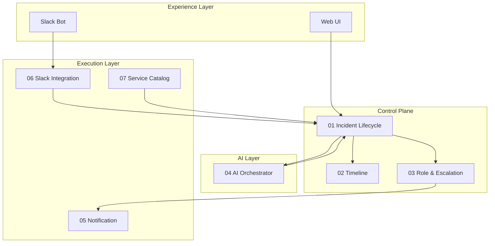

# PD Lite – AWS Architecture Index

This folder contains the complete AWS technical architecture and service-level designs for PD Lite.

## Documents

| # | Document | Description |
|---|----------|-------------|
| 00 | [AWS Architecture Overview](./00_aws_architecture_overview.md) | High-level AWS infrastructure, multi-region DR, security |
| 01 | [Incident Lifecycle Service](./01_incident_lifecycle_service.md) | Core state machine, incident CRUD, event emission |
| 02 | [Timeline Service](./02_timeline_service.md) | Append-only event log, AI context provision |
| 03 | [Role & Escalation Service](./03_role_escalation_service.md) | IC/responder management, on-call, escalation policies |
| 04 | [AI Orchestrator Service](./04_ai_orchestrator_service.md) | Agent coordination, proposals, guardrails |
| 05 | [Notification Service](./05_notification_service.md) | Multi-channel paging, telephony failover |
| 06 | [Slack Integration Service](./06_slack_integration_service.md) | Commands, events, channels, interactive components |
| 07 | [Service Catalog Connector](./07_service_catalog_connector.md) | Backstage sync, canonical service model |
| 08 | [Web UI Architecture](./08_web_ui_architecture.md) | React SPA, real-time updates, onboarding |
| 09 | [Development Roadmap](./09_development_roadmap.md) | 12-week MVP build phases, milestones, dependencies |
| 10 | [Environments & CI/CD](./10_environments_cicd.md) | Dev/staging/prod setup, GitHub Actions pipelines |
| 11 | [Observability (MELT)](./11_observability_melt.md) | Metrics, events, logs, traces strategy |

## Architecture Diagram

## Reading Order

1. Start with **00 AWS Architecture Overview** for infrastructure context
2. Read **01 Incident Lifecycle** as the core business logic 
3. Continue through remaining services in order

## Open Questions (Aggregated)

Collected from all service designs for discussion:

### Infrastructure
- Region preference: us-east-1/us-west-2 or different?
- ECS vs EKS for future Kubernetes portability?
- CDK vs Terraform for IaC?

### AI
- Bedrock vs OpenAI/Anthropic direct APIs?
- Agent version management during incidents?
- Rate limiting per incident for AI calls?

### Data
- Soft delete vs hard delete for incidents?
- Incident numbering: sequential vs UUID?

### Slack
- Multi-workspace support per tenant?
- Private vs public incident channels default?
- Auto-match users by email?

### UX
- Dark mode at launch?
- PWA/offline support?
- Keyboard shortcuts for power users?
