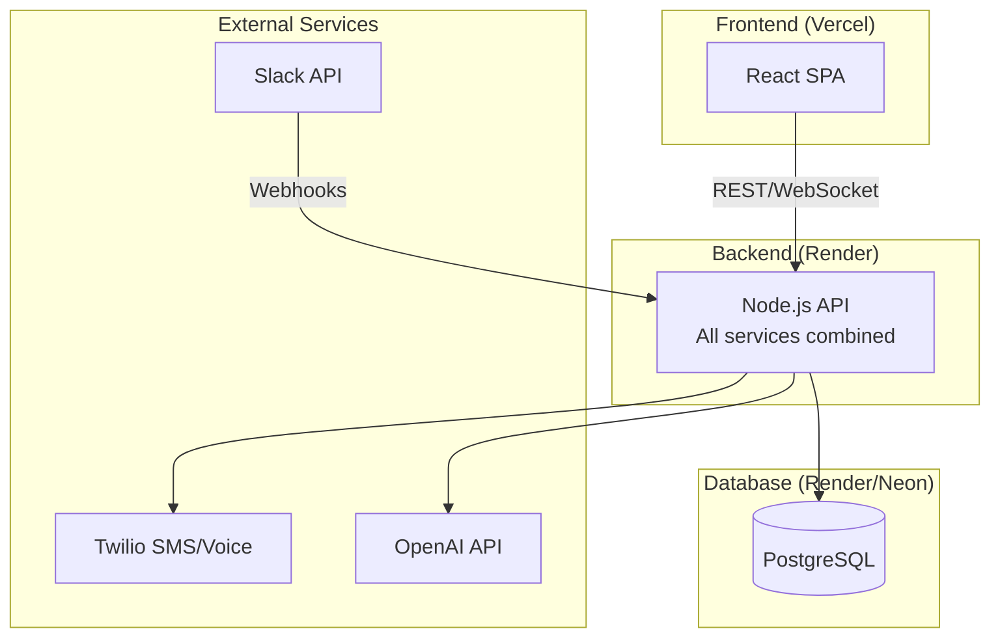
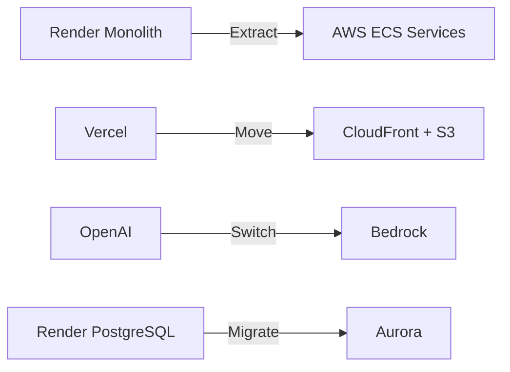

# PD Lite – Simple Architecture (Render + Vercel)

A streamlined, solo-developer-friendly architecture that gets PD Lite to MVP in weeks, not months.

---

## Architecture Overview



---

## Stack Comparison: AWS vs Simple

| Component | AWS (Complex) | Simple (Recommended) |
|-----------|---------------|----------------------|
| Backend | ECS Fargate (5 services) | Render (1 monolith) |
| Database | Aurora + DynamoDB | PostgreSQL only |
| Frontend | CloudFront + S3 | Vercel |
| AI | Bedrock | OpenAI API |
| Event Bus | EventBridge | In-process events |
| Auth | Cognito | Clerk or Auth.js |
| IaC | Terraform | None (UI deploys) |

---

## Platform Details

### Render (Backend + Database)

| Resource | Tier | Cost | Specs |
|----------|------|------|-------|
| Web Service | Starter | $7/month | 512MB RAM, auto-deploy |
| PostgreSQL | Starter | $7/month | 1GB storage, daily backups |
| **Total** | | **$14/month** | |

**Upgrade path:** Pro tier ($25/service) when you need more RAM or always-on.

### Vercel (Frontend)

| Resource | Tier | Cost | Specs |
|----------|------|------|-------|
| Web App | Hobby | $0 | 100GB bandwidth, auto-deploy |

**Upgrade path:** Pro ($20/month) when you need team features or more bandwidth.

### External APIs

| Service | Estimated Cost |
|---------|---------------|
| OpenAI (GPT-4o) | $20-50/month |
| Twilio (SMS/Voice) | $50-100/month |
| Clerk (Auth) | $0 (free tier) |
| **Total** | **$70-150/month** |

---

## Monolith Architecture

Instead of 5 microservices, build **one Node.js app** with clear module boundaries:

```
src/
├── index.ts              # Express app entry
├── modules/
│   ├── incidents/        # Incident lifecycle
│   │   ├── routes.ts
│   │   ├── service.ts
│   │   └── model.ts
│   ├── timeline/         # Timeline events
│   ├── roles/            # Role & escalation
│   ├── notifications/    # SMS/voice/push
│   ├── slack/            # Slack integration
│   ├── ai/               # OpenAI orchestration
│   └── catalog/          # Service catalog
├── lib/
│   ├── db.ts             # Prisma client
│   ├── openai.ts         # OpenAI client
│   ├── twilio.ts         # Twilio client
│   └── events.ts         # In-process event bus
└── middleware/
    ├── auth.ts
    └── logging.ts
```

### Why Monolith Works

- **Simpler deploys:** One service, one deploy
- **No network calls:** Module-to-module calls are function calls
- **Easier debugging:** One log stream, one trace
- **Lower latency:** No inter-service network hops
- **Extract later:** Split into microservices when needed

---

## Database Schema (PostgreSQL Only)

No DynamoDB—use PostgreSQL for everything:

```sql
-- Core tables
CREATE TABLE incidents (
    id              SERIAL PRIMARY KEY,
    tenant_id       UUID NOT NULL,
    incident_number INTEGER NOT NULL,      -- Sequential per tenant: INC-001
    title           VARCHAR(500) NOT NULL,
    severity        VARCHAR(20) NOT NULL,
    status          VARCHAR(20) NOT NULL,
    declared_at     TIMESTAMPTZ DEFAULT NOW(),
    resolved_at     TIMESTAMPTZ,
    ic_user_id      UUID,
    metadata        JSONB DEFAULT '{}',
    UNIQUE(tenant_id, incident_number)
);

-- Timeline events (append-only)
CREATE TABLE timeline_events (
    id              SERIAL PRIMARY KEY,
    incident_id     INTEGER REFERENCES incidents(id),
    event_type      VARCHAR(100) NOT NULL,
    actor_type      VARCHAR(20) NOT NULL,   -- 'human', 'ai', 'system'
    actor_id        VARCHAR(255),
    summary         TEXT,
    payload         JSONB,
    created_at      TIMESTAMPTZ DEFAULT NOW()
);

-- Notifications
CREATE TABLE notifications (
    id              SERIAL PRIMARY KEY,
    incident_id     INTEGER REFERENCES incidents(id),
    user_id         UUID NOT NULL,
    channel         VARCHAR(20) NOT NULL,   -- 'sms', 'voice', 'push'
    status          VARCHAR(20) NOT NULL,   -- 'pending', 'sent', 'delivered', 'failed'
    provider_id     VARCHAR(255),
    sent_at         TIMESTAMPTZ,
    delivered_at    TIMESTAMPTZ,
    acknowledged_at TIMESTAMPTZ
);

-- AI proposals
CREATE TABLE ai_proposals (
    id              SERIAL PRIMARY KEY,
    incident_id     INTEGER REFERENCES incidents(id),
    agent           VARCHAR(50) NOT NULL,
    proposal_type   VARCHAR(50) NOT NULL,
    content         JSONB NOT NULL,
    confidence      DECIMAL(3,2),
    status          VARCHAR(20) DEFAULT 'pending',
    decided_at      TIMESTAMPTZ,
    decision        VARCHAR(20)
);

-- Services (from Backstage sync)
CREATE TABLE services (
    id              SERIAL PRIMARY KEY,
    tenant_id       UUID NOT NULL,
    external_id     VARCHAR(255),
    name            VARCHAR(255) NOT NULL,
    owner_team      VARCHAR(255),
    tier            VARCHAR(20),
    metadata        JSONB DEFAULT '{}',
    synced_at       TIMESTAMPTZ
);

-- Users
CREATE TABLE users (
    id              UUID PRIMARY KEY,
    tenant_id       UUID NOT NULL,
    email           VARCHAR(255) NOT NULL,
    name            VARCHAR(255),
    phone           VARCHAR(50),
    slack_user_id   VARCHAR(50),
    created_at      TIMESTAMPTZ DEFAULT NOW()
);
```

---

## Technology Choices

| Layer | Technology | Why |
|-------|------------|-----|
| Runtime | Node.js 20 + TypeScript | Fast dev, great ecosystem |
| Framework | Express or Fastify | Simple, proven |
| Database ORM | Prisma | Type-safe, migrations |
| Frontend | React + Vite | Fast builds, TanStack Query |
| Auth | Clerk | Zero config, free tier |
| AI | OpenAI (GPT-4o-mini) | Cheaper than GPT-4, good enough |
| SMS/Voice | Twilio | Industry standard |
| Slack | Bolt.js | Official SDK |

---

## Deployment

### Render Setup

1. Connect GitHub repo
2. Create Web Service (Node.js)
3. Create PostgreSQL database
4. Add environment variables
5. Deploy automatically on push

### Vercel Setup

1. Connect GitHub repo (frontend folder)
2. Auto-detect Vite/React
3. Add environment variables
4. Deploy automatically on push

### Environment Variables

```bash
# Backend (Render)
DATABASE_URL=postgresql://...
OPENAI_API_KEY=sk-...
TWILIO_ACCOUNT_SID=AC...
TWILIO_AUTH_TOKEN=...
TWILIO_PHONE_NUMBER=+1...
SLACK_BOT_TOKEN=xoxb-...
SLACK_SIGNING_SECRET=...
CLERK_SECRET_KEY=sk_...
FRONTEND_URL=https://app.pdlite.io

# Frontend (Vercel)
VITE_API_URL=https://api.pdlite.io
VITE_CLERK_PUBLISHABLE_KEY=pk_...
```

---

## CI/CD (Simplified)

**No GitHub Actions needed initially!**

Both Render and Vercel auto-deploy on push to `main`.

```
Push to main → Render deploys backend (2-3 min)
             → Vercel deploys frontend (30 sec)
```

### When to add CI:

- Run tests before deploy
- Multiple environments (staging/prod)
- Database migrations need coordination

---

## What You Lose vs AWS

| Feature | Impact | Mitigation |
|---------|--------|------------|
| Multi-region DR | Downtime if Render has issues | Acceptable for MVP |
| EventBridge | Tighter coupling | In-process events, extract later |
| Bedrock | Vendor lock-in to OpenAI | OpenAI is fine, can switch |
| Cognito | Less enterprise auth | Clerk is simpler anyway |
| VPC isolation | Less network security | Render has its own isolation |

---

## Future Migration Path

When you have paying customers and need enterprise features:



The **AWS architecture docs remain valid**—you're just deferring that complexity.

---

## Revised Timeline

| Phase | Duration | Deliverable |
|-------|----------|-------------|
| Setup | 1 day | Render + Vercel + Clerk configured |
| Core API | 1 week | Incidents, timeline, basic roles |
| Slack Integration | 1 week | /incident declare, channels |
| AI + Notifications | 1 week | OpenAI suggestions, Twilio pages |
| Web UI | 1 week | Dashboard, incident detail |
| Polish & Launch | 1 week | Design partner onboarding |
| **Total** | **5 weeks** | MVP live |

vs. AWS approach: **12 weeks**

---

## Recommendation

**Start here.** Ship in 5 weeks. Get design partners. Migrate to AWS when you have:
- Paying customers
- Revenue to justify complexity
- Need for enterprise features

---

## Next Steps

1. Create Render account and Vercel account
2. Set up Clerk for auth
3. Create monorepo structure
4. Start building the incident module
